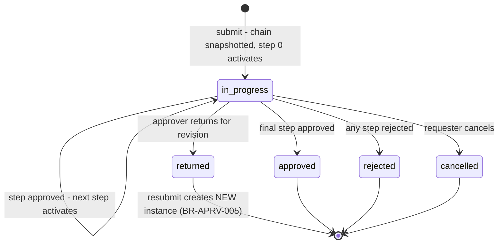
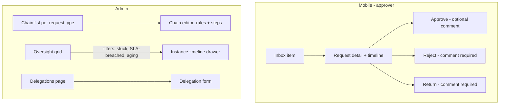

# Module: Approval Engine

Status: Active (Phase 2) · Related ADRs: `ADR-0008` (model — this doc implements it), `ADR-0005` (two-gate rule), `ADR-0003` (approvals online-only V1), `ADR-0010` (events/outbox) · Depends on: `docs/05-platform/authorization-rbac.md`, `docs/04-database/core-schema.md`, `docs/03-standards/api-standards.md` · Consumers: every request-bearing module (§13 declarations), `docs/05-platform/inbox.md`, `docs/05-platform/notification.md`

Namespace `approval` (naming §4, error prefix `APRV`). ADR-0008 fixed the model: module-owned domain effects, chain snapshots, step quorums, activation-time resolution, no auto-decide. This document owns schemas, state machines, ports/APIs, and `APRV_` codes.

## 1. Purpose & Scope

One generic engine for all request approvals: chain configuration (per tenant/company/request type, rule-based selection), instance execution (sequential steps, parallel approvers within a step), resolvers with vacancy fallbacks, self-approval guard, delegation, SLA reminder/escalation, immutable action trail.

**V1 exclusions:** auto-approve/auto-reject on SLA (never), business-hours SLA clocks, transitive delegation, conditional step skipping, quorum percentages, offline approval actions (ADR-0003), continue-on-reject.

## 2. Actors & Permissions

| Action | Permission key | Data scope | HR Admin | System Administrator |
|---|---|---|---|---|
| Read chain configs | `approval.chain.read` | company / tenant | ✅ | ✅ |
| Create/edit/delete chains | `approval.chain.configure` | company / tenant | ✅ | ✅ |
| Oversight grid (all instances, SLA state) | `approval.instance.read` | company / tenant | ✅ | ✅ |
| Manage another user's delegation | `approval.delegation.assign` | company / tenant | ✅ | ✅ |
| Own delegation (create/end) | — (authenticated self-service) | self | all roles | all roles |
| Act on an instance (approve/reject/return) | **module key** (e.g. `leave.request.approve`) **+ chain membership** — two-gate, BR-APRV-012 | instance | per module | per module |
| View an instance timeline | requester, current+past assignees, oversight readers | instance | — | — |

Acting endpoints live in the owning modules (§7 design decision); the engine's own HTTP surface is config, delegation, and read.

## 3. Business Rules

| # | Rule |
|---|---|
| BR-APRV-001 | Integration contract: modules submit `(requestType, requestId, requesterEmployeeId, context)` after their own domain validation; the engine never reads/writes domain tables and never validates domain semantics; modules never mutate instance state except through the engine port. Terminal events carry the domain effect back to the module. |
| BR-APRV-002 | Chain selection: evaluate the requester-company-scoped chains by `priority` (ascending, first match wins), then tenant-wide chains (`company_id NULL`) the same way. Conditions are an ordered list over declared context fields; a chain with empty conditions always matches (the default). No match at all → `APRV_NO_CHAIN_CONFIGURED` — the module surfaces it to the admin, the request is not submitted. |
| BR-APRV-003 | Provisioning seeds one tenant-wide default chain per registered request type: single step, `direct_manager(1)`, quorum `any` — every tenant approves out of the box. |
| BR-APRV-004 | The resolved chain config is **snapshotted** onto the instance at submission (jsonb). Config edits affect new instances only; in-flight fixes = cancel + resubmit (ADR-0008). |
| BR-APRV-005 | One live instance per request: partial unique on `(tenant_id, request_type, request_id) WHERE status = 'in_progress'`. Resubmission creates a new instance; the returned one stays terminal. |
| BR-APRV-006 | Approver **resolution happens at step activation**, not submission — org changes between steps are honored. Vacancy ladder per step: configured fallback (`skip` \| `fallback_resolver` \| fallback role `approval.fallback_role`, default HR Admin); if the ladder still yields nobody, the step stays `active` with zero assignees, the instance is flagged **stuck**, and System Administrator is notified. Never silently skipped past the last rung. |
| BR-APRV-007 | Self-approval guard: resolved approver = requester → default `reroute_next_level`; `skip_step` configurable; `allow` exists but is never a default and is called out in the chain editor. |
| BR-APRV-008 | Quorum: `any` — first action decides the step; `all` — every assignee must approve, any reject terminates. Reject is terminal for the instance at any step; **reject and return always require a comment** (`APRV_COMMENT_REQUIRED`). |
| BR-APRV-009 | Delegation redirects the actionable item at activation: engine resolves the original approver, then re-points to the live delegate (date-range match, request-type match). Delegate acts as themselves with `delegate_of` recorded; the original keeps read visibility. **No transitive delegation** — redirection applies exactly once. |
| BR-APRV-010 | SLA (calendar hours, V1): at `sla_hours` → reminder to assignees; at `2 × sla_hours` (platform-fixed multiplier) → escalation notice to each assignee's direct manager, or the fallback role when no manager resolves. Steps never auto-decide; instances stay pending and visible (oversight grid + inbox aging). |
| BR-APRV-011 | `return` sends the request back to the requester (instance terminal `returned`); resubmission restarts the **full chain** as a new instance. `cancel` is requester-only while `in_progress`; modules may further restrict cancel windows in their own rules before calling the port. |
| BR-APRV-012 | Two-gate enforcement: the module action endpoint checks its static permission; the engine port then verifies the actor is a live assignee of the active step (or their delegate). Non-assignees with the permission get `APRV_NOT_AN_APPROVER`. Users with no relationship to the instance get 404 (existence hiding). |
| BR-APRV-013 | Concurrency: assignee/step/instance rows carry `version`; double actions lose the optimistic check → `APRV_STEP_ALREADY_DECIDED`. Any action on a terminal instance → `APRV_INSTANCE_NOT_ACTIONABLE`. |
| BR-APRV-014 | Approval actions are online-only on mobile (ADR-0003): never queued, fail fast offline. |
| BR-APRV-015 | Every state change appends an immutable `approval_actions` row (actor, delegate-of, action, comment, step, timestamp) — including system rows (`escalated`, `reminded`, `skipped`, `rerouted`). No updates, no deletes. |

## 4. Domain Model

Owned tables (`src/database/schema/approval.ts` — all tenant-owned, standard RLS):

```ts
export const approvalQuorum = pgEnum('approval_quorum', ['all', 'any']);
export const approvalInstanceStatus = pgEnum('approval_instance_status',
  ['in_progress', 'approved', 'rejected', 'returned', 'cancelled']);
export const approvalStepStatus = pgEnum('approval_step_status',
  ['pending', 'active', 'approved', 'rejected', 'skipped']);
export const approvalActionType = pgEnum('approval_action_type',
  ['submit', 'approve', 'reject', 'return', 'cancel', 'reminded', 'escalated', 'skipped', 'rerouted']);

export const approvalChains = pgTable('approval_chains', {
  ...id, ...tenantId,
  companyId: uuid('company_id').references(() => companies.id),   // NULL = tenant-wide
  requestType: text('request_type').notNull(),                    // registry, §13
  name: text('name').notNull(),
  priority: integer('priority').notNull().default(100),           // ascending; default chain = highest number, empty conditions
  conditions: jsonb('conditions'),                                 // ordered [{ field, op, value }] — NULL/[] = always match
  steps: jsonb('steps').notNull(),                                 // config shape below; whole-chain read/write, no row-level queries → jsonb
  isActive: boolean('is_active').notNull().default(true),
  ...auditColumns, ...softDeleteColumns,
}, (t) => [
  index('idx_approval_chains_lookup').on(t.tenantId, t.requestType, t.companyId),
]);

export const approvalInstances = pgTable('approval_instances', {
  ...id, ...tenantId,
  companyId: uuid('company_id').notNull().references(() => companies.id), // requester's company at submit
  requestType: text('request_type').notNull(),
  requestId: uuid('request_id').notNull(),                        // module row id — no FK (ADR-0001 boundary)
  requesterEmployeeId: uuid('requester_employee_id').notNull().references(() => employees.id),
  requesterUserId: uuid('requester_user_id').notNull().references(() => users.id),
  status: approvalInstanceStatus('status').notNull().default('in_progress'),
  chainSnapshot: jsonb('chain_snapshot').notNull(),               // BR-APRV-004
  context: jsonb('context').notNull(),                            // module-declared fields
  currentStepIndex: integer('current_step_index').notNull().default(0),
  isStuck: boolean('is_stuck').notNull().default(false),          // BR-APRV-006
  version: integer('version').notNull().default(1),
  completedAt: timestamp('completed_at', { withTimezone: true }),
  ...auditColumns,
}, (t) => [
  uniqueIndex('uq_approval_instances_live')
    .on(t.tenantId, t.requestType, t.requestId).where(sql`status = 'in_progress'`),
  index('idx_approval_instances_oversight').on(t.tenantId, t.companyId, t.status),
]);

export const approvalSteps = pgTable('approval_steps', {
  ...id, ...tenantId,
  instanceId: uuid('instance_id').notNull().references(() => approvalInstances.id, { onDelete: 'cascade' }),
  stepIndex: integer('step_index').notNull(),
  name: text('name'),
  quorum: approvalQuorum('quorum').notNull(),
  slaHours: integer('sla_hours'),                                  // NULL = no SLA
  status: approvalStepStatus('status').notNull().default('pending'),
  activatedAt: timestamp('activated_at', { withTimezone: true }),
  remindedAt: timestamp('reminded_at', { withTimezone: true }),
  escalatedAt: timestamp('escalated_at', { withTimezone: true }),
  decidedAt: timestamp('decided_at', { withTimezone: true }),
  version: integer('version').notNull().default(1),
}, (t) => [
  uniqueIndex('uq_approval_steps_instance_idx').on(t.instanceId, t.stepIndex),
  index('idx_approval_steps_sla_scan').on(t.tenantId, t.status, t.activatedAt),
]);

export const approvalAssignees = pgTable('approval_assignees', {
  ...id, ...tenantId,
  stepId: uuid('step_id').notNull().references(() => approvalSteps.id, { onDelete: 'cascade' }),
  approverUserId: uuid('approver_user_id').notNull().references(() => users.id),
  delegateOfUserId: uuid('delegate_of_user_id').references(() => users.id), // BR-APRV-009
  status: approvalStepStatus('status').notNull().default('active'),        // active | approved | rejected | skipped
  actedAt: timestamp('acted_at', { withTimezone: true }),
  version: integer('version').notNull().default(1),
}, (t) => [
  uniqueIndex('uq_approval_assignees_step_user').on(t.stepId, t.approverUserId),
  index('idx_approval_assignees_inbox').on(t.tenantId, t.approverUserId, t.status), // inbox source
]);

export const approvalActions = pgTable('approval_actions', {     // immutable trail, BR-APRV-015
  ...id, ...tenantId,
  instanceId: uuid('instance_id').notNull().references(() => approvalInstances.id),
  stepId: uuid('step_id').references(() => approvalSteps.id),    // NULL = instance-level (submit/cancel)
  actorUserId: uuid('actor_user_id'),                             // NULL = system (reminded/escalated)
  delegateOfUserId: uuid('delegate_of_user_id').references(() => users.id),
  action: approvalActionType('action').notNull(),
  comment: text('comment'),
  createdAt: timestamp('created_at', { withTimezone: true }).notNull().defaultNow(),
}, (t) => [
  index('idx_approval_actions_instance').on(t.instanceId, t.createdAt),
]);

export const approvalDelegations = pgTable('approval_delegations', {
  ...id, ...tenantId,
  delegatorUserId: uuid('delegator_user_id').notNull().references(() => users.id),
  delegateUserId: uuid('delegate_user_id').notNull().references(() => users.id),
  requestTypes: text('request_types').array(),                    // NULL = all types
  startDate: date('start_date').notNull(),
  endDate: date('end_date').notNull(),
  revokedAt: timestamp('revoked_at', { withTimezone: true }),
  ...auditColumns,
}, (t) => [
  index('idx_approval_delegations_lookup').on(t.tenantId, t.delegatorUserId, t.startDate, t.endDate),
]);
```

Step config shape (inside `chains.steps` and `chain_snapshot`, validated at config write):

```jsonc
[{
  "name": "Direct manager",
  "quorum": "any",                          // all | any
  "slaHours": 24,                           // optional
  "resolvers": [                            // ≥1; union of resolved users
    { "type": "direct_manager", "levels": 1 },
    { "type": "position_holder", "positionId": "…" },
    { "type": "role_holders", "roleId": "…" },   // scoped to requester's company
    { "type": "specific_user", "userId": "…" }
  ],
  "onVacancy": { "policy": "fallback_role" },    // skip | fallback_resolver (+resolver) | fallback_role
  "onSelfApproval": "reroute_next_level"         // reroute_next_level | skip_step | allow
}]
```

Chain depth ≤ `approval.max_chain_depth` (default 5, settings.md). `approval_actions` is append-only (no RLS-exempt behavior — normal tenant RLS; append-only enforced by revoking UPDATE/DELETE from `hris_app` on this table, database-conventions §9 pattern).

**Audited: `approval_chains` and `approval_delegations` only — registered in audit-log §4.2** (added 2026-08-07, A-196). The two are configuration: a chain decides who approves a payroll run and a delegation hands that authority to somebody else, which is the class of act §4.2 exists for. The four execution tables stay out under BR-AUD-004 — `approval_actions` is the authoritative trail and a channel-1 diff of every claim would be a second copy of it. Audit takes the terminal events instead (§12).

### Instance lifecycle (= ADR-0008, restated as implementation spec)



### Step lifecycle

```mermaid
stateDiagram-v2
  [*] --> pending: created from snapshot
  pending --> active: previous step decided - resolution runs (BR-APRV-006)
  pending --> skipped: instance terminal before activation
  active --> approved: quorum met (any: first approve; all: last approve)
  active --> rejected: any assignee rejects
  active --> skipped: onVacancy skip / onSelfApproval skip_step
  approved --> [*]
  rejected --> [*]
  skipped --> [*]
```



Invariants: exactly one `active` step per `in_progress` instance (or zero while stuck-empty); assignee set is written only at activation; quorum evaluated inside the same transaction as the assignee action (version-guarded).

## 5. Use Cases

**UC-APRV-001 — Submit (port, called by module).** Precondition: module domain validation passed. Main: select chain (BR-APRV-002) → snapshot → create instance + step rows (`pending`) → activate step 0: run resolvers, apply self-approval guard, apply delegations, insert assignees → emit `approval.step.activated` → notification fan-out. Exceptions: no chain → `APRV_NO_CHAIN_CONFIGURED` (module aborts its submit transaction — port call is same-tx). Postcondition: instance `in_progress`, inbox items live.

**UC-APRV-002 — Approve (port, via module endpoint).** Two-gate check (BR-APRV-012) → assignee row version-update to `approved` → quorum evaluation: met → step `approved`; last step → instance `approved` + terminal event; else next step activates (resolution at activation). `all`-quorum partial approval leaves the step `active`, remaining assignees still actionable. Exceptions: `APRV_STEP_ALREADY_DECIDED` (version loss), `APRV_INSTANCE_NOT_ACTIONABLE`, `APRV_NOT_AN_APPROVER`.

**UC-APRV-003 — Reject.** Comment mandatory (BR-APRV-008) → assignee + step `rejected` → instance `rejected` → remaining assignees' items closed → terminal event → module applies domain effect (e.g. leave request → rejected).

**UC-APRV-004 — Return + resubmit.** Return: comment mandatory → instance `returned`, items closed, requester notified. Resubmit: module re-validates the edited request → new `submit` port call → fresh instance, full chain (BR-APRV-011). Old and new instances both reference the same `request_id` (history preserved; live-uniqueness holds).

**UC-APRV-005 — Cancel.** Requester identity checked; instance `in_progress` required; module rules may block earlier (its own endpoint). Items closed, event emitted.

**UC-APRV-006 — Delegation lifecycle.** Self-service create: date range + optional request types; overlap with an existing live delegation of the same scope → `APRV_DELEGATION_OVERLAP`; delegate = self → `APRV_SELF_DELEGATION`. Redirect applies to activations while live (BR-APRV-009); ending/revoking affects future activations only — already-assigned items stay with the delegate (they were validly assigned).

**UC-APRV-007 — SLA scan (job).** Per tenant: steps `active` with `sla_hours`, `activated_at + sla < now`, `reminded_at NULL` → reminder + action row. `activated_at + 2×sla < now`, `escalated_at NULL` → escalation notices (assignee's manager or fallback role) + action row. Idempotent by the two stamp columns.

**UC-APRV-008 — Chain configuration.** Editor CRUD with step-shape validation (resolver refs resolvable, depth ≤ max, exactly one empty-condition chain per (scope, requestType) enforced at write). Deactivating the default chain while others carry conditions → blocked (`VAL_VALIDATION_FAILED` field entry) — a type must keep a catch-all.

## 6. UI Flow



- **Approver surfaces (mobile-first):** detail screen shows the module request body + engine timeline (steps, actors, comments, delegate badges); action buttons per two-gate state — non-assignees see timeline without buttons. Offline: timeline cached read-only; action buttons disabled with the offline notice (BR-APRV-014, design-system sync truth line untouched).
- **Chain editor (admin):** ordered rule rows (field/op/value from the module-declared context fields), step builder with resolver pickers, self-approval and vacancy policy per step; `allow` self-approval renders a warning chip. Default chain pinned last, undeletable while siblings exist.
- **Oversight grid:** DataTable; SLA state column (ok / reminded / escalated / stuck); row → timeline drawer; no action buttons (admins act only if they're assignees — oversight ≠ approval rights).
- **Delegation:** self-service form (Settings, both surfaces); admin page lists all delegations (`approval.delegation.assign` to create for others).
- Timeline rendering: status vocabulary per design-system §2.3; comments verbatim; system rows (reminder/escalation) muted style.

## 7. API

**Design decision (two-gate made concrete):** action endpoints (`approve`/`reject`/`return`/`cancel`/`submit`) are **module-owned HTTP routes** (static `@RequirePermission` with the module's key) that call the engine **port** in-process — the engine exposes no public action endpoints. This keeps route permissions static (BR-AUTHZ-002), lets modules run pre/post domain logic in the same transaction, and the port enforces gate two (BR-APRV-012). Engine HTTP surface = config, delegations, reads:

| Endpoint | Permission | Pagination |
|---|---|---|
| `GET /api/v1/approval/chains` | `approval.chain.read` | offset |
| `POST /api/v1/approval/chains` | `approval.chain.configure` | — |
| `GET /api/v1/approval/chains/{id}` | `approval.chain.read` | — |
| `PATCH /api/v1/approval/chains/{id}` | `approval.chain.configure` | — |
| `DELETE /api/v1/approval/chains/{id}` | `approval.chain.configure` | — |
| `GET /api/v1/approval/instances` | `approval.instance.read` (oversight) | offset |
| `GET /api/v1/approval/instances/{id}` | visibility-scoped (BR-APRV-012 read set) | — |
| `GET /api/v1/approval/requests/{requestType}/{requestId}` | visibility-scoped | — |
| `GET /api/v1/approval/delegations` | own: — · all: `approval.delegation.assign` | offset |
| `POST /api/v1/approval/delegations` | own: — · for others: `approval.delegation.assign` | — |
| `POST /api/v1/approval/delegations/{id}/revoke` | own: — · others: `approval.delegation.assign` | — |

All: Queue-reachable **no** · Idempotency **—** (config CRUD single-row; module action endpoints declare their own idempotency).

#### GET /api/v1/approval/chains
Request: `?requestType=` `?companyId=` + offset params. Response 200: `data: [{ id, requestType, companyId, name, priority, isActive, stepCount, isDefault }]` + meta.

#### POST /api/v1/approval/chains · PATCH /api/v1/approval/chains/{id}
Request:
| Field | Type | Required | Rule |
|---|---|---|---|
| `requestType` | string | ✅ (create) | registered type (§13) |
| `companyId` | uuid | — | NULL = tenant-wide |
| `name` | string | ✅ | 3–80 |
| `priority` | int | — | ≥ 1; default 100 |
| `conditions` | array | — | ordered `{ field, op: eq\|neq\|gt\|gte\|lt\|lte\|in, value }`; fields from the type's declared context |
| `steps` | array | ✅ | 1–`approval.max_chain_depth`; shape per §4, refs resolvable |
| `isActive` | boolean | — | |

Response 201/200: chain detail. Errors: `VAL_VALIDATION_FAILED` — unknown context field, unresolvable resolver ref, depth exceeded, last-default deactivation (each a field entry).

#### DELETE /api/v1/approval/chains/{id}
Soft delete. Blocked for the only empty-condition chain of an active type (same field-entry rule as deactivation). In-flight instances unaffected (snapshots). Response 200: `{ id }`.

#### GET /api/v1/approval/instances
Request: `?requestType=` `?status=` `?stuck=true` `?slaState=reminded|escalated` `?companyId=` + offset. Response 200: `data: [{ id, requestType, requestId, requester: { employeeId, name }, status, currentStepIndex, stepCount, isStuck, slaState, createdAt, completedAt }]` + meta.

#### GET /api/v1/approval/instances/{id} · GET /api/v1/approval/requests/{requestType}/{requestId}
Second form returns the newest instance for the request (plus `previousInstanceIds`). Response 200: `{ id, requestType, requestId, status, context, requester, steps: [{ stepIndex, name, quorum, status, slaHours, activatedAt, assignees: [{ userId, name, delegateOf?, status, actedAt }] }], actions: [{ action, actorUserId?, actorName?, delegateOf?, comment, stepIndex?, createdAt }] }`. Outside the visibility set → 404.

#### POST /api/v1/approval/delegations
Request: `{ delegatorUserId? (admin form), delegateUserId, requestTypes?: string[], startDate, endDate }`. Response 201: delegation row.
Errors: `APRV_SELF_DELEGATION` · `APRV_DELEGATION_OVERLAP` — `details: { conflictingDelegationId }` · unknown users → 404.

#### POST /api/v1/approval/delegations/{id}/revoke
Response 200: `{ id }`. Future activations unaffected by past assignments (UC-APRV-006).

### Engine port (in-process, for module docs' §13)

`ApprovalPort`: `submit(cmd)`, `approve(actor, requestType, requestId, comment?)`, `reject(actor, …, comment)`, `return(actor, …, comment)`, `cancel(actor, …)` — all same-transaction with the module's unit of work; failures return the `APRV_` codes as `Result` failures for the module endpoint to surface.

## 8. Validation Rules

| Field | Rule | Error code |
|---|---|---|
| `steps` | 1..maxDepth; each step ≥ 1 resolver; quorum enum; SLA ≥ 1 h when present | `VAL_OUT_OF_RANGE` / `VAL_INVALID_ENUM` |
| `conditions[].op` | allowed op set | `VAL_INVALID_ENUM` |
| `conditions[].field` | declared for the request type | `VAL_INVALID_ENUM` |
| resolver refs | position/role/user exist and live in tenant | field entry + 404 semantics on probe |
| `startDate ≤ endDate` (delegation) | date pair | `VAL_DATE_RANGE_INVALID` |
| reject/return `comment` | required, ≤ 1000 | `APRV_COMMENT_REQUIRED` (business, not transport — may arrive with a valid DTO) |

## 9. Edge Cases & Failure Modes

- **`any`-quorum race:** two assignees approve simultaneously → version check serializes; loser gets `APRV_STEP_ALREADY_DECIDED`, UI refreshes timeline. Same mechanics for approve-vs-reject races.
- **Approver loses the module permission mid-step:** gate one fails at the module endpoint (403) even though gate two would pass — correct: permission is live, membership is snapshot-of-activation.
- **Assignee deactivated/offboarded mid-step:** their item goes unactionable; `all`-quorum would deadlock → SLA ladder surfaces it; admin fixes by cancel+resubmit (new resolution) — V1 accepts this manual path (no mid-flight re-resolution, BR-APRV-004 spirit).
- **Requester offboarded mid-flight:** instance continues (decisions may still matter for payroll); terminal event fires; module decides the domain effect's validity.
- **Delegation chain (A→B, B→C):** item for A redirects to B only (no cascade, BR-APRV-009). B's own delegation applies solely to items originally aimed at B.
- **Delegation created after activation:** existing active items stay with the original approver (redirect happens at activation only). Deliberate: retro-redirect would rewrite live inbox state.
- **Stuck instance (empty after fallback):** flagged, notified, visible in oversight `stuck=true`; resolution = fix org data (assign role/position) then cancel + resubmit, or act via a newly configured chain on resubmit.
- **Context field missing at submit:** conditions referencing it evaluate false → selection falls through to the default chain (ADR-0008 tradeoff, accepted).
- **Module submits inside a failing transaction:** port call is same-tx — rollback removes instance rows atomically; no orphan instances.
- **Clock skew on SLA:** scan uses DB `now()` vs `activated_at` — single clock source, no client time involved.

## 10. Offline Behavior

Deviation summary: approval **actions** are online-only (BR-APRV-014) — buttons disabled offline, no queueing, no `SYNC_` involvement. Inbox items and cached timelines are readable offline (inbox.md owns the cache class — reference data, pull-only). Nothing in this module writes to `local_sync_queue`.

## 11. Module Error Codes

Registered this session:

| Code | HTTP | Trigger |
|---|---|---|
| `APRV_NO_CHAIN_CONFIGURED` | 422 | Submit found no matching chain (default missing/inactive) — BR-APRV-002 |
| `APRV_NOT_AN_APPROVER` | 403 | Actor holds the module permission but is not a live assignee/delegate of the active step — BR-APRV-012 |
| `APRV_STEP_ALREADY_DECIDED` | 409 | Optimistic-version loss on assignee/step action — BR-APRV-013 |
| `APRV_INSTANCE_NOT_ACTIONABLE` | 409 | Action on a terminal (approved/rejected/returned/cancelled) instance — BR-APRV-013 |
| `APRV_COMMENT_REQUIRED` | 422 | Reject/return without comment — BR-APRV-008 |
| `APRV_SELF_DELEGATION` | 422 | Delegation to self — UC-APRV-006 |
| `APRV_DELEGATION_OVERLAP` | 409 | Live delegation already covers the range/type scope — UC-APRV-006, `details: { conflictingDelegationId }` |

## 12. Background Jobs & Events

| Job | Schedule | Behavior |
|---|---|---|
| `cron.approval.sla-scan` | every 15 min, per-tenant scan (ADR-0010) | UC-APRV-007; idempotent via `reminded_at`/`escalated_at` stamps |

Events emitted (outbox): `approval.step.activated` `{ instanceId, stepId, assigneeUserIds }` (inbox + notification consume), `approval.step.decided` `{ instanceId, stepId, outcome, actorUserId }` (added for inbox.md BR-INB-006 — precise sibling-item closure on `any`-quorum, instead of inferring from the next activation), `approval.assignee.acted` `{ instanceId, stepId, assigneeId, actorUserId, action }` (grilled 2026-08-02: emitted on **every recorded decision** — including partial `all`-quorum approvals that leave the step active — so the inbox completes the actor's item immediately, not at step/instance end), `approval.step.escalated` `{ instanceId, stepId, escalatedToUserIds }`, and the terminal set `approval.instance.approved | rejected | returned | cancelled` `{ instanceId, requestType, requestId, requesterUserId }` (owning module + inbox + notification + audit-log consume). Engine consumes no events — resolver queries hit the org module port synchronously at activation.

**`requesterUserId` added 2026-08-10** (`hris-api` notification module, A-198 — additive to a payload, so no supersession and no ADR). notification.md §4.2 makes the audience of `approval.instance_decided` *"the requester"*, and the terminal payload was the only recipient-bearing event in this set that did not name its recipient: `approval.step.activated` carries `assigneeUserIds` and `approval.step.escalated` carries `escalatedToUserIds`, both for exactly this reason. Without it the consumer has an instance id and no lawful way to turn it into a person — `approval_instances` is this module's table (ADR-0001 rule 2), and the payload carries no employee id either, so `employee_directory` cannot bridge it. It is the user id rather than the employee id because the notification addresses a login, and this module already resolves it through the view at submission. ADR-0010's *"payloads are pointers — ids and primitives"* is satisfied; the decision **comment** is deliberately not added, because free text in an event payload is content crossing a channel that logs by id.

## 13. Approval, Notification & Report Touchpoints

- **Consumer registry (V1 request types):** `leave.request`, `overtime.request`, `attendance.correction`, `expense.claim` (expense-reimbursement.md §13, declared 2026-08-03 — context `companyId`, `employeeId`, `branchId`, `departmentId`, `totalAmount`, `lineCount`, `categoryCodes`, `overPolicyLineCount`, `disburseVia`; `overPolicyLineCount` is the field that turns an advisory policy flag into an actual control, by letting a chain route an over-budget claim through a stricter approver instead of a validator refusing it), `employee.data_change`, `employee.resignation`, `recruitment.requisition` (recruitment-candidate.md §13, declared 2026-08-03 — context `companyId`, `positionId`, `departmentId`, `branchId`, `jobLevelRank`, `hiringManagerEmployeeId`, `openings`, `employmentType`; the two dimensions worth routing on are `jobLevelRank` and `openings`, which are the two shapes of "this costs more than one headcount"), `recruitment.offer` (recruitment-candidate.md §13, declared 2026-08-03 — context `companyId`, `requisitionId`, `positionId`, `departmentId`, `branchId`, `jobLevelRank`, `offeredBaseSalary`, `employmentType`, `revisionNumber`; `revisionNumber` plays the `overPolicyLineCount` role here — a first offer routes normally and a third renegotiation routes to someone senior, which is the only way negotiation becomes a control instead of a private loop, since the module has no compensation band to validate against), `payroll_run` (payroll.md §13, added 2026-08-02 — context `companyId`, `type`, `totalNet`, `employeeCount`, so a chain can route runs above a threshold through a second approver; no cancel window, because revocation is an explicit command refused after payment), `training.enrollment` (training.md §13, declared 2026-08-03 — context `companyId`, `employeeId`, `departmentId`, `branchId`, `courseId`, `categoryId`, `costAmount`, `sessionStartDate`; `costAmount` plays the `overPolicyLineCount` / `revisionNumber` role, routing a 500,000 IDR internal workshop to the direct manager and a 40,000,000 IDR external certification to whoever owns the budget, and `categoryId` is the second dimension because compliance training and discretionary development are approved by different people in most tenants. **Only self-requested enrollments reach the engine** — an HR assignment seats the employee directly and registers no instance, since BR-APRV-003's seeded `direct_manager(1)` default would otherwise route an already-budgeted nomination through the nominee's own line manager. Cancel window: the requester may cancel while `pending`, which cancels the instance; a session cancellation and an employee's terminal status change both cancel live instances through `ApprovalPort.cancel`. **A seat is allocated inside the transaction that records the completing approval**, so the terminal event handler never has to fail on a full room — training.md UC-TRN-005). Each owning module's §13 declares: context fields (name + type — the chain editor's field list), chain-selection dimensions it expects admins to use, terminal-event domain effects, and cancel-window rules. A new request type = module §13 declaration + registry entry here, same session.
- **Notification templates (notification.md):** step activated (push + in-app to assignees), reminder, escalation, terminal outcome to requester (+ returned-with-comment), stuck instance to System Administrator.
- **Inbox:** actionable items derive from live `approval_assignees` rows (`idx_approval_assignees_inbox`); actor completion via `assignee.acted`, sibling/remainder closure on step/instance events; deep links to module detail screens.
- **Reports:** approval aging / SLA breach summary via reports.md registry (source: oversight query).
- **Org module dependency:** reporting-line (`direct_manager(n)`) and position-holder queries — organization.md §4.2 exposes `directManagers`, `positionHolders` and, for §8's reference check, `positionExists` (2026-08-07).
- **Authz module dependency:** `RoleHolderPort` (authorization-rbac.md §4.1, declared 2026-08-07) — the `role_holders` resolver reads it by role id and BR-APRV-006's fallback rung reads it by role **key**, since `approval.fallback_role` names one. `user_roles` is that module's table and no other module may read it (ADR-0001 rule 2).
- **`employee_directory` (ADR-0001 rule 6):** the engine resolves the requester's company and user id, and every timeline name, through the published view rather than a port. Three facts about identity, none of them encrypted or masked, on a page-sized read a port cannot serve without one round trip per row. **The requester's company comes from the view and never from `context.companyId`** — context is what the calling module chose to send, and a wrong company here selects another company's approvers.

## 14. Test Scenarios

| Scenario | Covers |
|---|---|
| Selection: company chain beats tenant chain; priority order; condition ops; missing field → default | BR-APRV-002 |
| Config edit mid-flight → in-flight instance unchanged (snapshot), new submit uses new config | BR-APRV-004 |
| Double-submit same request while live → unique violation → module surfaces conflict | BR-APRV-005 |
| Vacancy ladder: skip / fallback resolver / fallback role / stuck+notify (each policy) | BR-APRV-006 |
| Self-approval: reroute adds next level; skip_step; allow acts | BR-APRV-007 |
| `any` race: concurrent approves → one wins, one 409; approve-vs-reject race | BR-APRV-008/013 |
| `all` quorum: partial approvals hold step active; single reject terminates instance | BR-APRV-008 |
| Reject without comment → 422 before any state change | BR-APRV-008 |
| Delegation: window boundaries (start/end day), type subset, no transitive redirect, post-activation delegation inert | BR-APRV-009 |
| SLA ladder: reminder at SLA, escalation at 2×, no auto-decide ever, idempotent rescan (fake clock) | BR-APRV-010 |
| Return → resubmit: new instance, step 0 restart, old instance terminal, same requestId history | BR-APRV-011 |
| Two-gate: permission-holding non-assignee → 403 `APRV_NOT_AN_APPROVER`; unrelated user → 404 | BR-APRV-012 |
| Port same-tx rollback: module tx fails after submit → no instance rows | UC-APRV-001 |
| Action-trail completeness: every scenario above leaves exact expected `approval_actions` rows | BR-APRV-015 |

## 15. Future Improvements

Business-hours/holiday-aware SLA clocks (holiday module enables it), quorum percentages, conditional step skip, amount-banded auto-approval as explicit chain config, mid-flight re-resolution for offboarded assignees, offline MSS approvals (gated on ADR-0003 revisit), onboarding-style long-running journeys (the Temporal trigger, ADR-0008).
