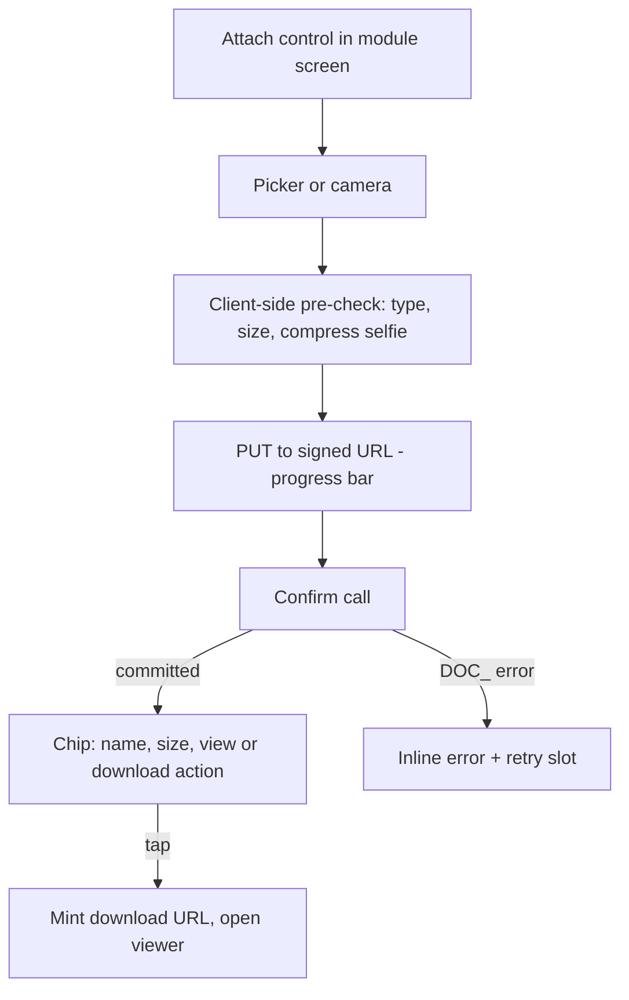

# Module: Document Storage

Status: Active (Phase 2) · Related ADRs: `ADR-0009` (model — this doc implements it), `ADR-0002` (tenant prefix hygiene), `ADR-0003` (offline selfie uploads ride sync), `ADR-0016` (Accepted — file *contents* are not field-encrypted; object storage relies on GCS at-rest encryption) · Depends on: `docs/04-database/core-schema.md`, `docs/03-standards/api-standards.md`, `docs/03-standards/naming-conventions.md` §11.4, `docs/05-platform/settings.md`, `docs/05-platform/notification.md`

Namespace `document` (naming §4, error prefix `DOC`). ADR-0009 fixed the model: signed-URL-only access, metadata as authority, direct-to-storage staged uploads, no inline AV in V1 (hook reserved). This document owns the `files` schema, the category registry, sign/confirm/download APIs, purge/expiry jobs, and `DOC_` codes.

## 1. Purpose & Scope

One pipeline for every stored file: upload slots (signed PUT into staging), commit verification (existence, size, magic-byte mime, sha256, move to final path), metadata registry, signed downloads, per-category policy (types, size, retention, expiry reminders), soft delete + object purge.

**V1 exclusions:** inline antivirus (`quarantined` status reserved, ClamAV post-GA — ADR-0009), image thumbnailing/derivatives, CMEK, folder browsing UI (files always attach to entities; no free-floating document manager), client-side Firebase SDK (never).

## 2. Actors & Permissions

File authorization is **delegated to the owning category** — this module has no standalone permission keys. The category registry (§4.2) maps each category to the module permission required to write/read and an ownership resolver; the generic endpoints are `@AuthenticatedOnly()` with the registry-driven check inside the use case — a **documented deviation** from static `@RequirePermission` (BR-AUTHZ-002 satisfied by the explicit marker + this paragraph; the route lint accepts `@AuthenticatedOnly`).

| Action | Gate |
|---|---|
| Request upload slot / confirm | category `writePermission` **+** ownership resolver (may I attach to this entity?) |
| Mint download URL / list by entity | category `readPermission` **+** data scope via the same resolver (self/team/company — ADR-0005 two-axis) |
| Delete file | category `writePermission` + resolver; some categories forbid client delete (generated documents, committed selfies — §4.2) |

Scope misses → 404 (existence hiding). Generated documents (payslips) are written only by workers — no client upload path exists for those categories.

## 3. Business Rules

| # | Rule |
|---|---|
| BR-DOC-001 | **Metadata is the authority** (ADR-0009): an object without a `committed` row does not exist for the application. Every access starts from the row; storage paths are generated (naming §11.4), never client-supplied or guessed. |
| BR-DOC-002 | All client access is via V4 signed URLs minted **after** permission + scope checks: GET 10 min (categories may shorten — payslips 2 min, §4.2), PUT constrained to exact content type + size range. The API never proxies bytes. |
| BR-DOC-003 | Uploads are two-phase (staged → committed). Staging prefix `uploads/{tenantId}/…` auto-deletes at 24 h (GCS lifecycle); a stale `staged` row past 24 h is purged by job — never trusted, never committed. |
| BR-DOC-004 | Commit verifies in order: object exists → size within category cap **and** matches the declared size → magic-byte mime matches declared mime and category whitelist → sha256 computed and stored → move to final path → row `committed`. Any failure leaves the row `staged` with the failure code recorded (client may retry the slot). |
| BR-DOC-005 | Type enforcement is three-layer (signed-URL constraint, magic-byte sniff, category whitelist) — extension is never consulted. Declared-vs-actual mismatch → `DOC_MIME_MISMATCH`, even when the actual type would itself be allowed. |
| BR-DOC-006 | Confirm is **idempotent**: confirming a `committed` file returns 200 with the existing metadata (offline drains replay safely). |
| BR-DOC-007 | Category policies (types, size caps) resolve through settings where marked tunable (§4.2, `document.*` keys) — caps tighten only downward from the registry ceiling (BR-SET-008 direction rule). |
| BR-DOC-008 | `document_expires_at` is business validity (KTP, contract, certification end) — set/edited by the owning module, never by this module. The expiry scan reminds the configured audience `document.expiry_reminder_days` before expiry, once per file per window. |
| BR-DOC-009 | Deletion is soft (row) with the object retained until the purge job (object-then-row, single direction — no orphan objects). Categories with statutory retention (generated payroll documents ≥ 10 years, database-conventions §4.4) refuse client deletes entirely. |
| BR-DOC-010 | Selfie category: client compresses to ≤ 1 MB jpeg; retention per `attendance.selfie_retention_months` (A-008 — registered by attendance.md); after purge the punch row keeps sha256 + metadata (ADR-0009). Selfie uploads during sync drains ride the same slot→PUT→confirm pipeline before the punch op posts (offline-sync ordering, §10). |
| BR-DOC-011 | No file content, name, or path in logs/telemetry (`security-standards` §10 registry — `originalName`, `storagePath` are redacted fields); `requestId` correlates sign/confirm/download for audit. |
| BR-DOC-012 | Tenant hygiene: every path carries the tenant prefix; signing never crosses the TenantContext boundary (multi-tenancy §6 row for storage). A leaked path grants nothing (signed-URL-only). |

## 4. Domain Model

### 4.1 Schema

```ts
// src/database/schema/document.ts
export const fileStatus = pgEnum('file_status', ['staged', 'committed', 'quarantined']); // quarantined reserved (ADR-0009)

export const files = pgTable('files', {
  ...id, ...tenantId,
  module: text('module').notNull(),                        // owning ns (naming §4)
  entityType: text('entity_type').notNull(),               // polymorphic owner
  entityId: uuid('entity_id').notNull(),
  category: text('category').notNull(),                    // registry key (§4.2)
  originalName: text('original_name').notNull(),           // sanitized at slot creation
  storagePath: text('storage_path').notNull(),             // generated, final after commit
  mime: text('mime').notNull(),
  sizeBytes: integer('size_bytes').notNull(),
  sha256: text('sha256'),                                  // set at commit
  status: fileStatus('status').notNull().default('staged'),
  commitFailureCode: text('commit_failure_code'),          // last BR-DOC-004 failure, staged rows only
  documentExpiresAt: date('document_expires_at'),          // business validity (BR-DOC-008)
  expiryRemindedAt: timestamp('expiry_reminded_at', { withTimezone: true }),
  uploadedBy: uuid('uploaded_by').references(() => users.id), // NULL = worker-generated
  ...auditColumns, ...softDeleteColumns,
}, (t) => [
  index('idx_files_entity').on(t.tenantId, t.entityType, t.entityId).where(sql`deleted_at IS NULL`),
  index('idx_files_expiry_scan').on(t.tenantId, t.documentExpiresAt)
    .where(sql`status = 'committed' AND document_expires_at IS NOT NULL AND deleted_at IS NULL`),
  index('idx_files_staged_sweep').on(t.tenantId, t.createdAt).where(sql`status = 'staged'`),
]);
```



```mermaid
stateDiagram-v2
  [*] --> staged: upload slot created (signed PUT issued)
  staged --> committed: confirm passes BR-DOC-004 chain
  staged --> staged: confirm fails - failure code recorded, client may retry PUT + confirm
  staged --> [*]: 24h sweep (row purged; object died with staging lifecycle)
  committed --> quarantined: reserved - async AV verdict (post-GA hook)
  committed --> [*]: soft delete then purge job (object, then row)
```

### 4.2 Category registry (code-owned — the settings/templates law)

Registry entry contract: `{ key, allowedMimes, maxSizeBytes (ceiling), sizeSettingKey?, retention (statutory class | settingKey | none), downloadUrlTtlSeconds, writePermission, readPermission, ownershipResolver (module port), clientDeletable, expiryReminders }`. Seed (ADR-0009 table, made concrete):

| Category | Mimes | Cap (ceiling) | URL TTL | Client delete | Expiry reminders | Permissions (write / read) |
|---|---|---|---|---|---|---|
| `punch_selfie` | image/jpeg | 1 MB | 600 s | ❌ (retention-purged) | — | attendance punch keys (attendance.md §2) |
| `employee_document` | application/pdf, image/jpeg, image/png | 10 MB | 600 s | ✅ | ✅ (BR-DOC-008) | employee doc keys (employee.md §2) |
| `receipt` | application/pdf, image/jpeg, image/png | 10 MB | 600 s | ✅ (while the claim is `draft` or `returned`) | — | write: the claim endpoints' own gate (self, or `expense.claim.create`); read: `expense.claim.read`, the claim's owner, or a live approver of its instance — expense's ownership resolver. Non-owner mints are a registered sensitive read (`expense.receipt.viewed`, audit-log §4.3) because a medical-category receipt is health data (expense-reimbursement.md BR-EXP-015) |
| `generated_document` | application/pdf | — (worker-only) | **120 s** | ❌ (statutory retention) | — | module payslip/tax read keys |
| `import_file` | xlsx | 20 MB | 600 s | ❌ (job artifact) | — | write: any import definition permission (slot user-parented, re-parented at job creation); read: source/error files = definition permission, export outputs = **requester only** (import-export BR-IMP-010, grilled 2026-08-02) |
| `candidate_file` | application/pdf, docx | 10 MB | 600 s | ✅ | — | write: `recruitment.candidate.create` / `.update` for CVs, `recruitment.offer.update` for signed offer scans; read: `recruitment.candidate.read`, **or** the requisition's hiring manager, **or** a panellist seated on one of the application's interviews — recruitment's ownership resolver, which resolves both `candidate` and `job_offer` entities. Retention = `recruitment.candidate_retention_days`, so `cron.document.purge` collects a CV once `cron.recruitment.candidate-purge` has soft-deleted it (recruitment-candidate.md BR-REC-017 — the row is anonymized in place and the object is the part that is genuinely destroyed). **Not a registered sensitive read**: a CV and a signed offer carry no employee health, identity-number, or financial data, and a mint-level audit row on every CV preview would be trail noise on the module's most ordinary action |
| `asset_document` | application/pdf, image/jpeg, image/png | 10 MB | 600 s | ✅ | — | write: the assignment and incident endpoints' own gates (`asset.item.assign`, `asset.incident.create`, or the employee reporting on an asset they hold); read: `asset.item.read`, or the employee named on the assignment the file is parented to — asset's ownership resolver, which resolves both `asset_assignment` and `asset_incident` entities. **Not a registered sensitive read**: a signed handover form and a photograph of a cracked screen carry no health, identity, or financial data, so the `receipt` treatment would be trail noise (asset.md §13). Two file kinds share the category — the signed handover and return scans, referenced by explicit columns on the assignment, and incident photographs, parented by `entityType`/`entityId` |
| `training_certificate` | application/pdf, image/jpeg, image/png | 10 MB | 600 s | ✅ | ❌ (see below) | write: `training.certification.create` / `.update`, or the employee recording their own credential; read: `training.certification.read`, or the employee the certification belongs to — training's ownership resolver, which resolves the `training_certification` entity. **Not a registered sensitive read**: a certificate scan carries no health, identity-number, or financial data, so the `receipt` treatment would be trail noise (asset and `candidate_file` precedent) |
| `announcement_attachment` | application/pdf, image/jpeg, image/png | 10 MB | 600 s | ✅ (while the post is a `draft`) | — | write: `announcement.post.create` / `.update`; read: `announcement.post.read`, **or being a recipient of the announcement the file is parented to** — announcement's ownership resolver, which resolves the `announcement` entity. Parented by `entityType`/`entityId` on the `asset_document` precedent, since a post carries N files and none of them is a named column. Retention follows the **post's** two keys (`announcement.retention_days` / `announcement.acknowledgment_retention_days`) rather than a category key: an attachment has no reason to outlive the announcement it belonged to, and `cron.announcement.purge` releases it to `cron.document.purge`. **Not a registered sensitive read**: a company policy PDF carries no health, identity-number, or financial data (asset, candidate-file, and training-certificate precedent). This category exists because there was otherwise **nowhere in the system to put a company-wide document** — `employee_document` is parented to one employee — and without it the distribution of a policy ends in an email nobody can audit |
| `leave_attachment` | application/pdf, image/jpeg, image/png | 10 MB | 600 s | ✅ (while the request is `pending` or `returned`) | — | write: the leave request endpoints' own gate (self, or `leave.request.create`); read: `leave.request.read`, the request's owner, or a live approver of its instance — leave's ownership resolver. Non-owner mints are a registered sensitive read (`leave.attachment.viewed`, audit-log §4.3) because a sick note is health data |

**`training_certificate`'s expiry reminders were turned off 2026-08-03 (training.md BR-TRN-013), and the promise moved rather than disappeared.** This registry entry predated the module that owns it, and when training arrived it turned out the expiry belongs on the **credential row** (`training_certifications.expires_on`), not on the file: a certification exists before its scan does and may never get one, so a file-driven reminder is silent for exactly the credentials nobody photographed. The compliance query — "who holds a valid K3 card, and whose lapses inside 60 days" — also runs against that row regardless, and two homes for one date is one too many. `training_certificate` files therefore carry `document_expires_at = NULL` and `cron.document.expiry-scan` skips them; `cron.training.reminders` sends `training.certification_expiring` instead. This is a repair of a Phase 2 forward promise, the same class as the settings §2 and §4.2 corrections, and it leaves **`employee_document` untouched** — employee.md reserves `document_expires_at` there "for KTP/cert validity", where the scan genuinely *is* the thing that expires.

Size caps tunable downward via `document.<category>_max_size_mb` settings where registered (this session: `document.employee_document_max_size_mb`, `document.receipt_max_size_mb` — the two admins actually ask about; others stay registry-fixed until needed). Owning modules bind their concrete permission keys + resolvers in their §2/§13 on arrival.

**The `ownershipResolver` port, declared 2026-08-07 (A-197, hris-api implementation).** Nine module documents say *"this module's ownership resolver"* and this section called it `(module port)`; nothing anywhere gave it a shape, which made it the one field of the entry contract an implementer had to invent. It is declared here rather than in each owning module because it is a **consumer contract this module publishes** — the `registerAuditedTables` relationship, not the `EmployeePayrollPort` one — and one shape is what lets the generic endpoints run one check.

```ts
export interface EntityRef { entityType: string; entityId: string }

export interface FileOwner {
  /** `files.module` — the owning namespace (naming §4). */
  readonly module: string;
  /** The entity types this owner resolves; anything else is not its file. */
  readonly entityTypes: readonly string[];
  canWrite(ref: EntityRef): Promise<boolean>;
  canRead(ref: EntityRef): Promise<boolean>;
  canDelete(ref: EntityRef): Promise<boolean>;
  /** §12's `document.download.gated_export` half: whether *this* file's mint is a
   *  sensitive read. Null for the ordinary case; the category's own
   *  `sensitiveReadKey` covers a category where every mint is one. */
  sensitiveReadKey?(file: FileRow): Promise<string | null>;
}
```

**`writePermission` and `readPermission` are answered inside those predicates rather than declared beside them**, and the seed table is why: half its rows state a gate no static key can express — *"self, or `expense.claim.create`"*, *"or a live approver of its instance"*, *"or being a recipient of the announcement"*, *"while the claim is `draft` or `returned`"*. Keeping the expressible half as registry data and the rest as prose would have left the rest unenforced. §2's *"category permission **+** ownership resolver"* is unchanged as a rule; it is one call that answers both halves, in the module that holds the keys.

**Every predicate returns `false`, never an error** — §2 already says a scope miss is 404, and it is the reason this module has no permission keys of its own to raise a 403 with.

**A category with no registered owner is not live.** A slot request for one is 404, not an unguarded upload — which makes registration the gate rather than a decoration, and means the nine categories whose owning module has not shipped carry their full policy and refuse every request until it does.

## 5. Use Cases

**UC-DOC-001 — Request upload slot.** Client: category, entityType/entityId, fileName, declared mime + size. Registry check (category live, mime whitelisted, size ≤ effective cap) → write gate + ownership resolver → sanitized name, generated `fileId` + staging path → staged row → signed PUT (exact mime, size range) valid 15 min. Errors: `DOC_TYPE_NOT_ALLOWED`, `DOC_SIZE_EXCEEDED`.

**UC-DOC-002 — Confirm.** BR-DOC-004 chain. Object absent/size-zero → `DOC_UPLOAD_INCOMPLETE` (row stays staged). Sniff mismatch → `DOC_MIME_MISMATCH`. Success → committed row returned. Replay → BR-DOC-006 no-op success.

**UC-DOC-003 — Download.** Metadata row → read gate + resolver → V4 GET signed for the category TTL → `{ url, expiresAt }`. Client may re-request freely (each mint re-checks authorization — permission revocation bites at the next mint, not mid-URL; TTLs keep that window ≤ 10 min).

**UC-DOC-004 — Worker-generated files (payslips, 1721-A1, export outputs, error reports).** Workers write objects directly to the final path via the GCS SDK and insert `committed` rows in the same unit of work (no staging — bytes never left the server). `uploadedBy NULL`; category `generated_document`/`import_file`.

**UC-DOC-005 — Delete.** Gate + `clientDeletable` check → soft delete. Purge job later: delete object → hard-delete row (object-then-row, BR-DOC-009). Statutory categories → `DOC_DELETE_FORBIDDEN`.

**UC-DOC-006 — Expiry scan (job).** Daily per tenant: committed files with `document_expires_at ≤ today + document.expiry_reminder_days` and `expiry_reminded_at NULL` → notification `document.expiring` to the owning module's configured audience (HR Admin default) → stamp. One reminder per file in V1 (multi-window ladders are a Future item).

## 6. UI Flow

No standalone document surface — files render inside owning-module screens (employee documents tab, expense receipt attach, punch detail). This module fixes the shared component behavior:



- Shared kit: `FileAttachment` (Flutter) / `FileAttachment` (admin, shadcn wrapper) — progress, retry, committed chip, error states from `errors.DOC_*` keys. Hand-rolled uploaders are review blockers (design-system kit-first rule).
- Images preview inline (signed GET); PDFs open in viewer (mobile: `FLAG_SECURE` for payslip category per security-standards §12); non-image types download with `Content-Disposition: attachment` (ADR-0009).
- Upload progress states per design-system §2.3 (unsynced/pending vocabulary for selfie-during-sync).

## 7. API

All: gates per §2 (registry-driven — documented deviation) · Pagination: `GET /documents` offset (entity-scoped lists are small; grid family).

| Endpoint | Queue-reachable | Idempotency |
|---|---|---|
| `POST /api/v1/documents/uploads` | **yes** (selfie drain path) | accepted — `opId` derives slot identity |
| `POST /api/v1/documents/uploads/{fileId}/confirm` | **yes** | idempotent by design (BR-DOC-006) |
| `GET /api/v1/documents` | no | — |
| `GET /api/v1/documents/{fileId}/download-url` | no | — |
| `DELETE /api/v1/documents/{fileId}` | no | — |

#### POST /api/v1/documents/uploads
Request:
| Field | Type | Required | Rule |
|---|---|---|---|
| `category` | string | ✅ | registry key |
| `entityType` / `entityId` | string / uuid | ✅ | resolver-verified ownership |
| `fileName` | string | ✅ | ≤ 255, sanitized server-side |
| `mime` | string | ✅ | category whitelist |
| `sizeBytes` | int | ✅ | ≤ effective cap |

Response 201: `{ fileId, uploadUrl, uploadExpiresAt }`.
Errors: `DOC_TYPE_NOT_ALLOWED` — `details: { allowed }` · `DOC_SIZE_EXCEEDED` — `details: { maxBytes }` · entity miss/scope → 404.

#### POST /api/v1/documents/uploads/{fileId}/confirm
Request: `{}` (identity is the resource). Response 200: file metadata (below).
Errors: `DOC_UPLOAD_INCOMPLETE` — object missing/empty · `DOC_MIME_MISMATCH` — `details: { declared, sniffed }` · `DOC_SIZE_EXCEEDED` — actual object over cap/declared.

#### GET /api/v1/documents
Request: `?entityType=&entityId=` (required pair) + offset params. Response 200: `data: [{ id, category, originalName, mime, sizeBytes, sha256, documentExpiresAt, uploadedBy, createdAt }]` + meta. Committed, non-deleted rows only.

#### GET /api/v1/documents/{fileId}/download-url
Response 200: `{ url, expiresAt }` (category TTL). Staged/deleted/scope-miss → 404.

#### DELETE /api/v1/documents/{fileId}
Response 200: `{ id }`. Errors: `DOC_DELETE_FORBIDDEN` — category `clientDeletable: false` (statutory retention or system artifact).

## 8. Validation Rules

| Field | Rule | Error code |
|---|---|---|
| `category` | registry key | `VAL_INVALID_ENUM` |
| `fileName` | required, ≤ 255; sanitation strips path separators/control chars (server-side, not a rejection) | `VAL_REQUIRED` / `VAL_TOO_LONG` |
| `mime` | syntactic media type; whitelist is business (`DOC_TYPE_NOT_ALLOWED`) | `VAL_INVALID_FORMAT` |
| `sizeBytes` | int ≥ 1; cap is business (`DOC_SIZE_EXCEEDED`) | `VAL_OUT_OF_RANGE` |
| `entityType`/`entityId` | known type; UUID | `VAL_INVALID_ENUM` / `VAL_INVALID_FORMAT` |

## 9. Edge Cases & Failure Modes

- **PUT succeeded, confirm never called** (app killed): staging lifecycle deletes the object ≤ 24 h; sweep purges the row; module entity shows no attachment — client re-uploads. Offline punch selfies are immune: the local file stays under queue protection until *both* upload and punch op succeed (ADR-0003).
- **Confirm race (two devices, same slot):** first commits; second hits BR-DOC-006 idempotent success. Different slots for the same logical document = two files; the owning module decides replace-vs-append semantics.
- **Client uploads different bytes than declared:** size range on the signed PUT rejects large deviations at GCS; commit verification catches the rest (`DOC_SIZE_EXCEEDED` / `DOC_MIME_MISMATCH`) — declared metadata never wins over verified bytes (BR-DOC-004).
- **Malicious-but-well-formed PDF:** accepted V1 residual risk, ADR-0009 posture — never executed/inline-served from app origin; `attachment` disposition; AV hook reserved.
- **Download URL shared/leaked:** dies within TTL; re-mint requires authorization. Payslip 120 s TTL narrows the window on the most sensitive class.
- **Permission revoked between list and download:** mint re-checks (UC-DOC-003) → 404 — the list was advisory (BR-INB-001 spirit: metadata list is navigation, mint is enforcement).
- **Object missing for a committed row** (manual bucket surgery): download mint verifies object existence lazily on GCS 404 → row flagged, Sentry event, `SYS_INTERNAL` to client — inconsistency is loud, never silent.
- **Tenant suspension:** guard blocks all endpoints (multi-tenancy §2); scheduled purge/retention jobs continue (suspension ≠ retention pause).
- **Clock skew vs URL expiry:** GCS evaluates expiry server-side; clients treat failed GET as expired → re-mint (no local clock trust — auth §9 pattern).

## 10. Offline Behavior

Deviations (offline-sync §10 checklist): metadata lists = **reference data** (pull-only per owning entity). Queueable ops: **upload slot + confirm** for sync-class categories (`punch_selfie`, offline `receipt` attach) — drain order per aggregate: slot → PUT → confirm → then the referencing module op (punch/claim) posts with `fileId`; a failed upload blocks the dependent op in the same aggregate queue (oldest-first per aggregate, offline-sync §4). Local files under queue protection are excluded from cache cleanup (ADR-0003 pending-data law). Downloads offline: previously fetched files may be cached by the OS viewer only — the app never builds an offline document store in V1.

## 11. Module Error Codes

Registered this session:

| Code | HTTP | Trigger |
|---|---|---|
| `DOC_TYPE_NOT_ALLOWED` | 422 | Declared mime outside category whitelist — UC-DOC-001 |
| `DOC_SIZE_EXCEEDED` | 422 | Declared or actual size over the effective cap — UC-DOC-001/002 |
| `DOC_UPLOAD_INCOMPLETE` | 422 | Confirm found no/empty staged object — BR-DOC-004 |
| `DOC_MIME_MISMATCH` | 422 | Magic-byte sniff contradicts declared mime — BR-DOC-005 |
| `DOC_DELETE_FORBIDDEN` | 409 | Delete on a non-client-deletable category — BR-DOC-009 |

## 12. Background Jobs & Events

| Job | Schedule | Behavior |
|---|---|---|
| `cron.document.staged-sweep` | hourly, scan + fan-out | purge `staged` rows > 24 h (objects already lifecycle-deleted) — BR-DOC-003 |
| `cron.document.expiry-scan` | daily | UC-DOC-006; idempotent via `expiry_reminded_at` |
| `cron.document.purge` | daily | soft-deleted rows past category retention + retention-expired selfies (A-008): object-then-row — BR-DOC-009/010 |

Events emitted (outbox): `document.file.committed` `{ fileId, category, entityType, entityId }`, `document.file.deleted` `{ fileId, category }` — audit-log consumes both. Consumed: none (modules call ports/endpoints synchronously). **Sensitive-read auditing (amended for audit-log §4.3):** every `generated_document` URL mint calls `AuditPort.sensitiveRead('document.download.generated_document', …)` in the same request — payslip/tax-document access leaves an access record (UU PDP). Likewise `document.download.gated_export` (grilled 2026-08-02): mints of `import_file` export outputs whose frozen column set includes gated columns — the import-export resolver flags them. Both are **fail-closed** (audit-log UC-AUD-003): the insert precedes the URL; insert failure aborts the mint.

## 13. Approval, Notification & Report Touchpoints

- **Approval:** none — attachment rules (e.g. receipt required before expense submit) are owning-module business rules.
- **Notification:** template registered this session in notification §4.2 — `document.expiring` (in_app + email, mandatory, audience: HR Admins of the owning company; params: document name, employee, expiry date).
- **Reports:** storage usage per tenant/category surfaces in platform health (system-administration); document-expiry report via reports.md registry (source: expiry-scan query).
- **Ports served:** `StorageUsagePort` — **added 2026-08-04 for system-administration.md UC-ADM-010**, discharging the platform-health promise on the line above. One method, no filters, no pagination:

  ```ts
  export const STORAGE_USAGE_PORT = Symbol('STORAGE_USAGE_PORT');

  export interface StorageUsagePort {
    /** Aggregates live file metadata for the tenant in the caller's TenantContext.
     *  Category keys are this module's own (§4.2); the caller renders, never interprets. */
    usageByCategory(): Promise<Array<{ category: string; fileCount: number; totalBytes: number }>>;
  }
  ```

  Deliberately narrow in three ways. It takes **no `tenantId`** — the tenant comes from context, per multi-tenancy §1 rule 2, so a platform caller cannot aggregate the wrong tenant by passing an argument. It returns **counts and bytes only**, never file names, owners, or paths, so the widest-privileged console in the system learns how much a tenant stores and nothing about what.

  **`DocumentPort` — UC-DOC-004's port, declared 2026-08-10 with its first caller** (A-200, `hris-api` import-export). Four module documents (`announcement.md`, `training.md`, `expense-reimbursement.md`, `asset.md`) name a document port and none declares its shape, so none was built — the `EmployeePayrollPort` line of A-195. What changed is not that argument but its premise: UC-DOC-004 has always described a **worker write path** — *"workers write objects directly to the final path via the GCS SDK and insert `committed` rows in the same unit of work"* — and until import-export there was no worker to use it. That module generates an error workbook and an export output and reads back an uploaded one, and those four methods are defined entirely by this use case rather than guessed at.

  ```ts
  export const DOCUMENT_PORT = Symbol('DOCUMENT_PORT');

  export interface GeneratedFileCommand {
    category: string; entityType: string; entityId: string; fileName: string; mime: string;
  }

  export interface DocumentPort {
    /** UC-DOC-004 — bytes to the final path, hashed and counted on the way past,
     *  and a `committed` row in the same unit of work. No staging: there is no
     *  uploader to distrust, and the digest and size are measured rather than declared. */
    storeGenerated(command: GeneratedFileCommand, write: (sink: Writable) => Promise<void>): Promise<FileRow>;
    /** `null` for an unknown, deleted, or still-staged file. */
    find(fileId: string): Promise<FileRow | null>;
    /** Bytes of a committed file, for a worker that parses them (import-export UC-IMP-002).
     *  Not a client path — ADR-0009's "the API never proxies bytes" binds the metadata
     *  plane between a client and storage, and nothing here reaches an HTTP response. */
    openContent(fileId: string): Promise<Readable | null>;
    /** import-export UC-IMP-001's re-parent: a slot is user-parented before the job
     *  that will own it exists. The entity moves and nothing else — a method that could
     *  also change the category would be a way around the registry. */
    reparent(fileId: string, ref: EntityRef): Promise<void>;
    /** Retires a file the calling module owns, releasing it to `cron.document.purge`.
     *  Deliberately **not** gated by `clientDeletable`: that flag answers "may a user
     *  delete this" on UC-DOC-005's endpoint, and the module whose retention window just
     *  expired is a different actor (import-export §12 collects its files "via
     *  document-storage"). */
    softDelete(fileId: string): Promise<void>;
  }
  ```

  **No download minting here**, and that is the boundary that keeps §13's earlier claim true: every client read still goes through `GET /documents/{fileId}/download-url`, where the gate, the category TTL and the sensitive-read trail live. A port that minted URLs would be a second access path with none of it.
- **Settings registered this session:** `document.expiry_reminder_days` (default 30), `document.employee_document_max_size_mb` (10, tighten-only), `document.receipt_max_size_mb` (10, tighten-only) → settings §4.2.

## 14. Test Scenarios

| Scenario | Covers |
|---|---|
| Slot → PUT → confirm happy path; row committed, path moved, sha256 stored | BR-DOC-004 |
| Confirm with no PUT → `DOC_UPLOAD_INCOMPLETE`, row staged, retry succeeds | BR-DOC-004 |
| png bytes declared as pdf → `DOC_MIME_MISMATCH` (even though png is allowed for the category) | BR-DOC-005 |
| Oversize declared → slot 422; oversize actual (declared small) → confirm 422 | BR-DOC-002/004 |
| Confirm replay ×3 → identical 200 (drain safety) | BR-DOC-006 |
| Download mint re-checks: revoke permission → next mint 404; URL expiry honored by GCS | UC-DOC-003 |
| Statutory category delete → `DOC_DELETE_FORBIDDEN`; deletable category → soft delete → purge removes object then row | BR-DOC-009 |
| Staged sweep leaves fresh staged rows; purges > 24 h | BR-DOC-003 |
| Expiry scan reminds once (stamp), respects `document.expiry_reminder_days` | BR-DOC-008 |
| Selfie drain order: upload fails → punch op stays queued (aggregate ordering), local file preserved | BR-DOC-010, §10 |
| Path generation: tenant prefix always present; sanitation strips `../` from names | BR-DOC-012, §8 |
| Worker-generated payslip: committed row + object in one unit of work, no staging | UC-DOC-004 |

## 15. Future Improvements

ClamAV async pipeline (external-origin categories first — `quarantined` status + code activate then), CMEK per tenant, thumbnail/derivative worker for admin grids, multi-window expiry reminder ladder, per-tenant storage quotas (platform health first, enforcement second), offline document store on mobile if field usage demands it.
