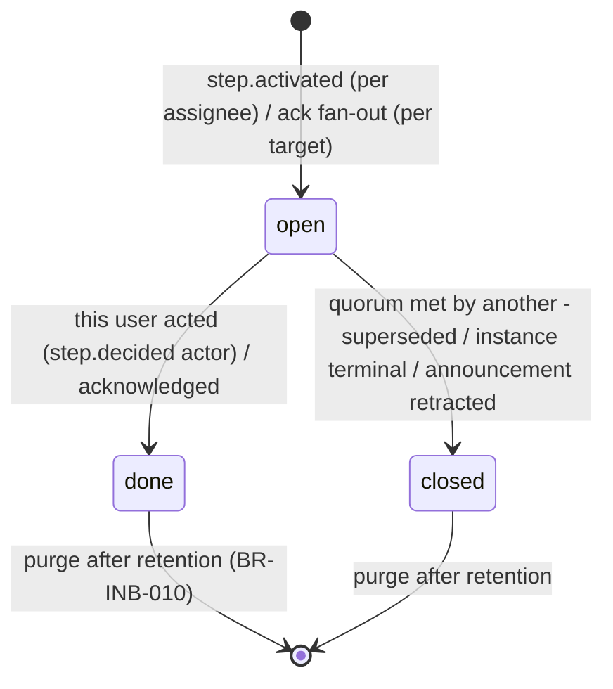
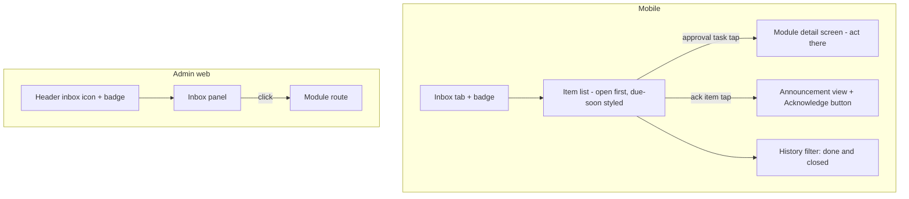

# Module: Inbox

Status: Active (Phase 2) · Related ADRs: `ADR-0008` (approval items source), `ADR-0010` (event-driven materialization), `ADR-0003` (acknowledge is queueable; approval actions are not) · Depends on: `docs/05-platform/approval-engine.md`, `docs/05-platform/notification.md` (feed vs inbox split), `docs/03-standards/api-standards.md`, `docs/02-architecture/offline-sync.md` §10 · Consumers: `docs/06-modules/announcement.md` (acknowledgment items)

Namespace `inbox` (naming §4, error prefix `INB`). The unified **task list**: things a user must act on. Informational traffic is the notification feed (notification.md) — the two never mix: a notification tells you something happened; an inbox item waits for you.

## 1. Purpose & Scope

Materialized per-user task items from two sources — approval step assignments and acknowledgment requirements (announcements) — with open-count badge, seen state, deep links into the owning module, and acknowledgment as the one action the inbox itself owns.

**V1 exclusions:** inline approval actions (module endpoints own them — approval-engine §7 design decision), snooze/dismiss of approval tasks, manual/self-created todos, admin views of other users' inboxes (oversight = approval-engine grid).

## 2. Actors & Permissions

Entirely self-service:

| Action | Permission | Who |
|---|---|---|
| List own items, open count | — (authenticated) | all roles |
| Mark own items seen | — (authenticated) | all roles |
| Acknowledge own acknowledgment items | — (authenticated) | all roles |

Approval items deep-link into module screens where the module's permission + the engine's two-gate check apply (BR-APRV-012) — the inbox grants nothing.

## 3. Business Rules

| # | Rule |
|---|---|
| BR-INB-001 | **The inbox is a navigation layer, never state truth.** Items materialize from events; the owning module's state is authoritative — the deep-linked detail screen always renders live source state, and acting happens there (approval tasks) or via acknowledge (ack items). A stale item misleads nobody: the target screen tells the truth. |
| BR-INB-002 | Item lifecycle: `open` (actionable) → `done` (this user acted) or `closed` (resolved without this user — quorum met by someone else, instance terminal, announcement retracted; `closed_reason` records which). Approval items are never dismissible — they leave via action, quorum, terminality, or escalation-driven resolution, not by swipe. |
| BR-INB-003 | Badge = **count of `open` items**. `seen_at` is presentation only (bold vs regular) and never reduces the badge — a task glanced at is still a task. |
| BR-INB-004 | Materialization is event-driven and idempotent: one item per `(tenant_id, user_id, dedupe_key)` — `dedupe_key` = assignee row id (approval) or announcement id (ack). Redeliveries no-op on the unique index (ADR-0010 law). |
| BR-INB-005 | Titles/subtitles render once at creation in the recipient's locale (notification BR-NTF-006 pattern); `params` stored for re-render only if a future feature needs it. |
| BR-INB-006 | Approval-task closure is precise, not inferred (grilled 2026-08-02): the actor's own item flips `done` on `approval.assignee.acted` — emitted per recorded decision, so a partial `all`-quorum approver's task completes immediately, not at step end; `approval.step.decided` closes sibling items (`any`-quorum losers → `closed/superseded`); instance terminals close all remaining open items of that instance. |
| BR-INB-007 | **Acknowledge is queue-reachable** (the one offline-writable action here): sync class *append-only fact*, idempotent by item id — replay/double-tap returns success no-op. Approval actions remain online-only (BR-APRV-014) and never enter the queue. |
| BR-INB-008 | Acknowledging a non-ack item → `INB_NOT_ACKNOWLEDGEABLE`; acknowledging a `closed` item (announcement retracted) → `INB_ITEM_CLOSED`. Acknowledging a `done` item → 200 no-op (offline replay safety). |
| BR-INB-009 | `due_at` mirrors the source deadline for sorting/urgency styling only — approval step `activated_at + sla_hours`, or an acknowledgment item's `dueAt` from `createAckItems` (announcement.md's `acknowledge_by`, added 2026-08-03). SLA mechanics (reminder/escalation) stay in the engine, and **an acknowledgment deadline has no mechanics at all** — announcement registers no reminder cron, because an `open` item never purges under BR-INB-010 and is therefore already a permanent nag. |
| BR-INB-010 | Items purge after `inbox.retention_days` (default 180 — registered in settings §4.2 this session) once non-`open`; `open` items never purge (a pending task must not silently vanish — stuck instances are the engine's problem to surface, BR-APRV-006). |

## 4. Domain Model

```ts
// src/database/schema/inbox.ts
export const inboxItemType = pgEnum('inbox_item_type', ['approval_task', 'acknowledgment']);
export const inboxItemStatus = pgEnum('inbox_item_status', ['open', 'done', 'closed']);

export const inboxItems = pgTable('inbox_items', {
  ...id, ...tenantId,
  userId: uuid('user_id').notNull().references(() => users.id),
  type: inboxItemType('type').notNull(),
  status: inboxItemStatus('status').notNull().default('open'),
  dedupeKey: text('dedupe_key').notNull(),               // BR-INB-004
  title: text('title').notNull(),                        // locale snapshot (BR-INB-005)
  subtitle: text('subtitle'),
  params: jsonb('params').notNull(),
  sourceRef: jsonb('source_ref').notNull(),              // approval: { instanceId, stepId, assigneeId, requestType, requestId }
                                                         // ack: { announcementId }
  deepLink: text('deep_link').notNull(),
  dueAt: timestamp('due_at', { withTimezone: true }),    // BR-INB-009
  seenAt: timestamp('seen_at', { withTimezone: true }),
  doneAt: timestamp('done_at', { withTimezone: true }),
  closedReason: text('closed_reason'),                   // superseded | instance_approved | instance_rejected |
                                                         // instance_returned | instance_cancelled | retracted
  createdAt: timestamp('created_at', { withTimezone: true }).notNull().defaultNow(),
}, (t) => [
  uniqueIndex('uq_inbox_items_dedupe').on(t.tenantId, t.userId, t.dedupeKey),
  index('idx_inbox_items_list').on(t.tenantId, t.userId, t.status, t.createdAt),
]);
```



Invariants: one item per dedupe key per user; `open` items never purged; `done_at`/`closed_reason` mutually exclusive with each other's status.

## 5. Use Cases

**UC-INB-001 — Materialize approval tasks.** `on.approval.step.activated` → for each `assigneeUserIds` entry: render title ("Leave request · Budi Santoso · 3 days" — request summary fields from the event's context snapshot), compute `due_at`, insert item (conflict → no-op). Delegate items carry the delegate as `user_id` with the original in `params` (badge copy per design-system).

**UC-INB-002 — Close/complete approval tasks.** `on.approval.assignee.acted` → that assignee's item `done` (fires per recorded decision — partial `all`-quorum included). `on.approval.step.decided` → remaining siblings `closed/superseded` (`any` quorum); `all`-quorum non-actors stay `open` until they act or the step decides. `on.approval.instance.*` terminals → all remaining open items of the instance close with the matching reason. Handlers idempotent (status transitions guarded by current-state check).

**UC-INB-003 — List + badge.** Cursor list, newest-first, filters `?type=` `?status=` (default `open`). Badge = open count. Visiting the list marks visible items seen (client batches `seen` calls).

**UC-INB-004 — Acknowledge.** Ack item `open` → `done` + emit `inbox.item.acknowledged` (announcement module consumes for its ack-rate tracking). Queueable offline (BR-INB-007): mobile enqueues with `opId`; drain hits the same idempotent endpoint.

**UC-INB-005 — Ack fan-out (port, for announcement.md).** `InboxPort.createAckItems(announcementId, targetUserIds, titleParams, deepLink, dueAt?)` → chunked inserts (≤ 500 per job, notification BR-NTF-009 pattern); retraction calls `closeAckItems(announcementId)` → open items `closed/retracted`. **`dueAt` added 2026-08-03 on announcement.md's arrival** — the announcement's optional `acknowledge_by` date, which lands on `inbox_items.due_at` and renders as BR-INB-009's urgency styling. Optional because most announcements carry no deadline; when it is absent the item sorts by age like any other. This is the only signature change the first real consumer needed, which is the port working as intended.

## 6. UI Flow



- Item row: type icon, title, subtitle, relative time, due-at urgency chip when `due_at` near/past (status vocabulary — `pending`/`negative` classes, never color-alone), delegate badge ("for Sari Wijaya") when acting as delegate.
- Approval rows carry **no action buttons** — the target screen owns actions (BR-INB-001); ack rows show the acknowledge affordance inline on the detail view.
- Offline: list cached; ack button works (queues, unsynced chip per design-system §2.3); approval taps open cached detail read-only with the offline notice.
- Empty states: "No tasks" (open filter) distinct from "No history".

## 7. API

| Endpoint | Permission | Pagination | Queue-reachable | Idempotency |
|---|---|---|---|---|
| `GET /api/v1/inbox` | — (own) | cursor | no | — |
| `GET /api/v1/inbox/count` | — (own) | — | no | — |
| `PATCH /api/v1/inbox/{id}` | — (own) | — | no | — |
| `POST /api/v1/inbox/seen-all` | — (own) | — | no | — |
| `POST /api/v1/inbox/{id}/acknowledge` | — (own) | — | **yes** | accepted (`opId` = key) |

#### GET /api/v1/inbox
Request: `?cursor&limit&type=&status=` (default `status=open`). Response 200: `data: [{ id, type, status, title, subtitle, deepLink, dueAt, seenAt, doneAt, closedReason, delegateOf?, createdAt }]`, `meta.nextCursor`. Structurally user-scoped.

#### GET /api/v1/inbox/count
Response 200: `{ open }` — badge source (BR-INB-003); same polling posture as the notification badge.

#### PATCH /api/v1/inbox/{id}
Request: `{ seen: true }` (only mutable field here; no unsee). Response 200: `{ id, seenAt }`. Others' items → 404.

#### POST /api/v1/inbox/seen-all
Operation-style (auth §7 precedent). Response 200: `{ updatedCount }` — stamps `seen_at` on all unseen items.

#### POST /api/v1/inbox/{id}/acknowledge
Response 200: `{ id, doneAt }` — `done` items return their existing `doneAt` (no-op success, BR-INB-008).
Errors: `INB_NOT_ACKNOWLEDGEABLE` — approval task targeted · `INB_ITEM_CLOSED` — retracted announcement.

## 8. Validation Rules

| Field | Rule | Error code |
|---|---|---|
| `type` / `status` filters | enum values | `VAL_INVALID_ENUM` |
| `cursor` / `limit` | api-standards §5 | `VAL_INVALID_CURSOR` |
| `seen` | literal `true` | `VAL_INVALID_FORMAT` |

## 9. Edge Cases & Failure Modes

- **Item lags source (event latency):** approver acts on the module screen → their item flips `done` ~1–2 s later via `assignee.acted`. Clients optimistically mark the local item on action success; server truth converges. A user seeing a just-closed sibling item taps through → module screen shows "already decided" (BR-INB-001 by design).
- **`all`-quorum sibling visibility:** step stays active after one approval — remaining items stay `open` correctly; only `step.decided` closes.
- **Delegation ends mid-step:** items already created for the delegate stay theirs (approval-engine UC-APRV-006 — assignment was valid); no re-pointing.
- **Ack after retraction race:** offline ack drains against a retracted announcement → `INB_ITEM_CLOSED` → sync outcome per class rules (terminal, offline-sync §5); mobile shows the retracted notice.
- **Event lost (relay/handler exhaustion):** item missing from inbox but the approval exists — engine SLA ladder + oversight grid backstop discovery; failed handler visible in the failed-jobs view. Inbox never invents items to compensate (BR-INB-001).
- **User offboarded with open items:** approval engine handles the chain (stuck/escalation); the ex-user's items stay `open` but unreachable — instance terminal closes them eventually; purge ignores `open` (accepted residue, bounded by instance lifecycle).
- **Duplicate ack from two devices:** first wins `done`; second → no-op 200 (BR-INB-008) — no conflict surfaced to users for an idempotent fact.
- **Deep link to a purged request:** module fallback rule (notification BR-NTF-011 mirror).

## 10. Offline Behavior

Deviations from the global standard (offline-sync §10 checklist):

- **Entities:** `inbox_items` — sync class **reference data** (pull-only cursor sync; local Drift mirror for the tab + badge).
- **Queueable ops:** `acknowledge` only — sync class **append-only fact**, `opId` = Idempotency-Key, terminal-state rules per class (a `INB_ITEM_CLOSED` rejection is terminal, surfaced as the retracted notice, no retry).
- **Seen marks offline:** cosmetic replay lane (offline-sync §10, grilled 2026-08-02) — applied to Drift immediately, re-sent fire-and-forget on reconnect, never queued; loss harmless (badge counts `open`, not seen).
- Approval taps offline: cached read-only detail; action buttons disabled (BR-APRV-014).
- Badge counts from local cache between pulls; server count wins on reconnect.

## 11. Module Error Codes

Registered this session:

| Code | HTTP | Trigger |
|---|---|---|
| `INB_NOT_ACKNOWLEDGEABLE` | 422 | Acknowledge on an `approval_task` item — BR-INB-008 |
| `INB_ITEM_CLOSED` | 409 | Acknowledge on a `closed` item (announcement retracted) — BR-INB-008 |

## 12. Background Jobs & Events

| Job | Trigger | Behavior |
|---|---|---|
| `on.approval.step.activated` | relay | UC-INB-001 |
| `on.approval.assignee.acted` | relay | UC-INB-002 (actor `done` — per decision) |
| `on.approval.step.decided` | relay | UC-INB-002 (siblings `superseded`) |
| `on.approval.instance.approved\|rejected\|returned\|cancelled` | relay | UC-INB-002 (close remaining) |
| `cron.inbox.purge` | daily, scan + fan-out | delete non-`open` items past `inbox.retention_days` (BR-INB-010) |

Events emitted (outbox): `inbox.item.acknowledged` `{ itemId, userId, sourceRef }` — announcement.md consumes for ack tracking. **Engine event dependencies added for this module:** `approval.step.decided` `{ instanceId, stepId, outcome, actorUserId }` and — grilled 2026-08-02 — `approval.assignee.acted` `{ instanceId, stepId, assigneeId, actorUserId, action }`, both appended to approval-engine §12 (BR-INB-006 needs precise completion/closure, not inference from the next activation).

## 13. Approval, Notification & Report Touchpoints

- **Approval:** consumer only — items from assignee activations; actions happen in module endpoints (engine port). **Port consumed: `ApprovalTaskPort.stepTasks` (approval-engine §7, added 2026-08-10, A-199)** — `approval.step.activated` carries `{ instanceId, stepId, assigneeUserIds }` and materializing an item needs five things it does not: the **assignee row id** BR-INB-004 makes the `dedupe_key`, the `requestType` and `requestId` §4's `source_ref` holds, the `activated_at + sla_hours` sum BR-INB-009 sorts on, the delegate pairing UC-INB-001 badges, and the requester and context UC-INB-001 renders the title from. All of it is on the engine's tables, which ADR-0001 rule 2 puts behind its port; ADR-0010's *"consumers re-read state by id"* is the channel.
- **Notification:** disjoint by design — step activation produces both a push (notification.md `approval.step_activated`) and an inbox item; the push is the nudge, the item is the task. No template registered by this module.
- **Reports:** none owned; ack-rate reporting belongs to announcement.md — **discharged 2026-08-03**, where it is served by `AnnouncementQueryPort.acknowledgmentRegister` and the `announcement.acknowledgment` export, because that module holds the frozen recipient set and therefore the only correct denominator; approval aging to the engine's oversight/reports.
- **2026-08-03 (announcement.md arrival):** the acknowledgment source this module was built for is now live. Three contracts written here before the consumer existed all held without amendment — `dedupe_key` = the announcement id (BR-INB-004), `closed_reason = 'retracted'` (BR-INB-002), and `INB_ITEM_CLOSED` on an ack against a retracted post (BR-INB-008). One signature gained an optional parameter (`dueAt`, UC-INB-005). Announcement deliberately registers **no acknowledge endpoint of its own**: this module owns the action because it owns the offline queue class, and that module owns the fact, stamped from `inbox.item.acknowledged`.

## 14. Test Scenarios

| Scenario | Covers |
|---|---|
| Step activation ×2 (redelivery) → one item per assignee | BR-INB-004 |
| `any` quorum: actor `done` via `assignee.acted`, sibling `closed/superseded` on `step.decided`; `all` quorum: partial approver `done` immediately, non-actors stay `open` until step decides | BR-INB-002/006 |
| Instance cancelled → all open items `closed/instance_cancelled` | UC-INB-002 |
| Badge counts open only; seen-all leaves count unchanged | BR-INB-003 |
| Ack: open→done + event; repeat → 200 no-op same `doneAt`; on approval task → 422; on retracted → 409 | BR-INB-007/008 |
| Offline ack queued → drain success; drain against retracted → terminal outcome, retracted notice | BR-INB-007, offline-sync §5 |
| Purge removes done/closed past retention, never open | BR-INB-010 |
| Delegate item carries delegate badge params; original user has no item | UC-INB-001 |
| Locale snapshot: title in recipient locale at creation, stable after switch | BR-INB-005 |

## 15. Future Improvements

Snooze on ack items (never approval tasks), returned-request task items for requesters (grilled 2026-08-02: V1 relies on the mandatory decision push + module my-requests state; revisit if returned requests rot unactioned), admin delegated-inbox view (support scenario), item grouping by request type, real-time badge (shared websocket decision with notification.md), read-optimized materialized counts if badge queries ever show up in p95.
