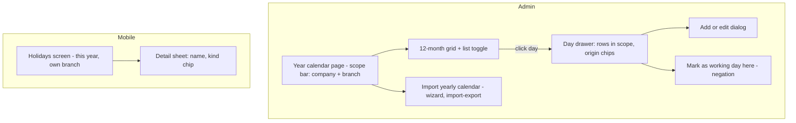

# Module: Holiday

Status: Active (Phase 3 — **reference module**; structure locked as the template for every business module once approved) · Related ADRs: `ADR-0002` (tenant scoping), `ADR-0015` (yearly import), `ADR-0010` (change events) · Depends on: `docs/04-database/core-schema.md`, `docs/05-platform/settings.md`, `docs/05-platform/import-export.md`, `docs/05-platform/audit-log.md` · Consumers: attendance.md (day-type derivation), leave.md (net-day calculation, cuti bersama deduction), overtime.md (holiday multiplier class), shift.md (schedule interplay), payroll.md (period context)

Namespace `holiday` (naming §4, error prefix `HOL`). National holiday + cuti bersama calendars per year, company/branch overrides, yearly Excel import, and the resolution port every time-math consumer calls. Inherits all global standards; this document specifies domain rules and deviations only.

## 1. Purpose & Scope

Maintain the tenant's non-working-day truth: the yearly Indonesian national calendar (hari libur nasional + cuti bersama, announced annually by SKB 3 Menteri), tenant additions, company/branch-scoped additions and negations, and one resolution answer — *is this date a working day for this employee's scope, and if not, why*. Downstream effects (attendance status, leave deduction, overtime multipliers) are owned by their modules against this module's port.

**V1 exclusions:** recurrence engine (Islamic-calendar dates shift yearly — every year is imported explicitly), religious-observance calendars per employee, half-day holidays, automatic government-feed ingestion (import template is the feed).

## 2. Actors & Permissions

| Action | Permission key | Data scope | Employee | Manager | HR Staff | HR Admin | System Administrator |
|---|---|---|---|---|---|---|---|
| View resolved calendar (own scope) | — (authenticated; mobile + web) | self (own branch) | ✅ | ✅ | ✅ | ✅ | ✅ |
| View raw rows + admin calendar | `holiday.calendar.read` | company / tenant per assignment | — | — | ✅ | ✅ | ✅ |
| Create / edit / delete holiday rows | `holiday.calendar.configure` | company / tenant per assignment | — | — | — | ✅ | ✅ |
| Run yearly import | `holiday.calendar.import` (ImportDefinition `holiday.calendar`) | tenant | — | — | — | ✅ | ✅ |

Company-scoped admins configure only rows within their companies (tenant-wide rows require a tenant-wide assignment — BR-AUTHZ-007 mirror); out-of-scope rows are 404 (existence hiding).

## 3. Business Rules

| # | Rule |
|---|---|
| BR-HOL-001 | A holiday row **adds** a non-working day at its scope; a row with `observed = false` **negates** a broader-scope day (company works a national holiday; branch works a company day). Rows never modify other rows — resolution composes them. |
| BR-HOL-002 | **Resolution is most-specific-wins per (date, kind):** branch row > company row > tenant-wide row. A date is non-working when the winning row (or any unnegated row, absent narrower rows) has `observed = true`. Display priority when multiple kinds land on one date: `national` > `cuti_bersama` > `custom`. |
| BR-HOL-003 | One row per `(scope, date, kind)` — partial unique on live rows. A second event on the same date at the same scope is the same row edited, not a sibling. |
| BR-HOL-004 | An `observed = false` row is valid only when a broader-scope row exists for the same `(date, kind)` — negating nothing is a configuration error (`HOL_NOTHING_TO_OVERRIDE`), checked at write time and at import commit. |
| BR-HOL-005 | Branch scope implies company scope: `branch_id` set ⇒ `company_id` set (DB CHECK). Dates are calendar dates (`date` column) — branch timezones never shift a holiday (a holiday is the same date everywhere; time-of-day math belongs to attendance/shift). |
| BR-HOL-006 | **Cuti bersama deduction is company policy, not calendar data:** setting `holiday.cuti_bersama_deducts_leave` (company level, **effective-dated** — policy may change per year). The leave module reads it as-of the leave date and owns the deduction arithmetic. A negated cuti bersama day (BR-HOL-001) deducts nothing — it is a workday there. > ⚠️ VERIFY: confirm against current Indonesian regulation before implementation. — cuti bersama deduction basis (SKB/circular) and whether tenants may lawfully opt out of deduction. |
| BR-HOL-007 | Yearly import (`ImportDefinition holiday.calendar`, upsert on `(date, kind)` tenant-wide, partial commit) **adds and updates only** — it never deletes rows absent from the file; removals are explicit admin acts. Import writes tenant-wide rows only; scoped rows are UI work. |
| BR-HOL-008 | Mutations to rows whose date falls inside a **locked attendance/payroll period** are rejected (`HOL_PERIOD_LOCKED`) via **`PeriodLockPort`** — recomputing derived attendance/pay under a changed calendar after lock is forbidden. The port is owned and implemented by `docs/06-modules/attendance.md` §4.2 (the module that owns the frozen data owns the freezing — grilled 2026-08-02); the "answers open until payroll.md lands" stub this rule originally shipped with is retired. |
| BR-HOL-009 | Every mutation (create/edit/delete/negate) is audited with diffs — `holidays` is registered in the audit channel-1 table registry (audit-log §4.2, this session's entry). Calendar changes additionally emit `holiday.calendar.changed` for consumers recomputing derived future state. |
| BR-HOL-010 | Mobile carries the resolved calendar offline (attendance day-type derivation must work in a basement): delta-sync per api-standards §8, reference-data class, tombstones evict deleted rows. Consumers on-device use the same resolution rule (BR-HOL-002) — implemented once in the shared Dart domain code. |

## 4. Domain Model

### 4.1 Schema

```ts
// src/database/schema/holiday.ts
export const holidayKind = pgEnum('holiday_kind', ['national', 'cuti_bersama', 'custom']);

export const holidays = pgTable('holidays', {
  ...id, ...tenantId,
  companyId: uuid('company_id').references(() => companies.id),  // NULL = tenant-wide
  branchId: uuid('branch_id').references(() => branches.id),     // NULL = company-wide
  date: date('date').notNull(),
  name: text('name').notNull(),
  kind: holidayKind('kind').notNull(),
  observed: boolean('observed').notNull().default(true),         // false = negation (BR-HOL-001)
  ...auditColumns, ...softDeleteColumns,
}, (t) => [
  uniqueIndex('uq_holidays_scope_date_kind')
    .on(t.tenantId, sql`COALESCE(company_id, '00000000-0000-0000-0000-000000000000')`,
        sql`COALESCE(branch_id, '00000000-0000-0000-0000-000000000000')`, t.date, t.kind)
    .where(sql`deleted_at IS NULL`),                             // BR-HOL-003
  index('idx_holidays_resolve').on(t.tenantId, t.date).where(sql`deleted_at IS NULL`),
  index('idx_holidays_year').on(t.tenantId, t.companyId, t.date),
]);
```

Hand-written in the generating migration (database-conventions §10): `CHECK (branch_id IS NULL OR company_id IS NOT NULL)` (BR-HOL-005). Version column: none — holidays are admin-edited reference data, not offline-mutable (no optimistic locking per database-conventions §1.10 scope).

No lifecycle state machine: a holiday row is present/soft-deleted reference data; `observed` is configuration, not state. (Template note for later modules: when an entity has no lifecycle, say so explicitly — do not force a diagram.)

### 4.2 Resolution port (the consumer contract)

```ts
export const HOLIDAY_QUERY_PORT = Symbol('HOLIDAY_QUERY_PORT');

export interface HolidayQueryPort {
  /** Winning verdict for one date in one scope (BR-HOL-002). */
  dayType(companyId: string, branchId: string | null, date: string):
    Promise<{ working: boolean; holiday?: { kind: HolidayKind; name: string } }>;
  /** All non-working dates in [from, to) for a scope — leave net-day math, shift planning. */
  nonWorkingDays(companyId: string, branchId: string | null, from: string, to: string):
    Promise<{ date: string; kind: HolidayKind; name: string }[]>;
}
```

Resolution is a pure function over the scope's rows — implemented once server-side (repository query + reduce) and once in shared Dart domain code over the local mirror (BR-HOL-010); both covered by the same golden test vectors (§14).

## 5. Use Cases

**UC-HOL-001 — Resolve a date (port, hot path).** Attendance derivation reaches `dayType` per punch date **through** `ShiftQueryPort`, which applies holiday suppression once when it resolves the scheduled day (shift.md §4.2, attendance.md §4.3) — one question, one answer, no second opinion. Rows for the date across the scope chain → most-specific per kind → verdict. No rows → working day. Cached per (tenant, company, branch, date) in Redis with bust on `holiday.calendar.changed` (write-through is overkill; the event exists anyway).

**UC-HOL-002 — Admin creates/edits a row.** Scope check (§2) → uniqueness (BR-HOL-003) → negation validity when `observed=false` (BR-HOL-004) → period-lock port (BR-HOL-008) → write + audit + event. Editing `date` on an existing row = delete + create semantics in one transaction (the unique key moves).

**UC-HOL-003 — Negate a day for a scope.** Admin picks an inherited day in the scoped calendar view → "mark as working day here" → creates the `observed=false` row at the narrower scope (UC-HOL-002 path). Removing the negation deletes that row; the broader day resumes.

**UC-HOL-004 — Yearly import.** Download template (`holiday.calendar`, columns: `date`, `name`, `kind` [enum sheet: national, cuti_bersama]) → upload → dry-run → confirm (import-export pipeline wholesale). Row validation: date parse, kind enum, in-file `(date, kind)` duplicates, per-row period-lock check (BR-HOL-008 applies at commit too). Upsert updates `name` on existing `(date, kind)` rows; `custom` kind is rejected in import files (scoped/custom rows are deliberate UI acts, BR-HOL-007).

**UC-HOL-005 — Employee views holidays.** Mobile: resolved calendar for own branch, current + next year, from the local mirror (offline-capable). Web (any authenticated role): same resolved view for the caller's scope.

**UC-HOL-006 — Consumer recompute on change.** `holiday.calendar.changed` → attendance recomputes derived day types for affected **future** dates in scope; leave revalidates pending requests spanning changed dates (consumer-owned reactions, listed in their §12s — this module only guarantees the event fires with the changed dates).

## 6. UI Flow



- **Scope bar** (design-system §12 signature device): company + branch selection drives the resolved view; every inherited day shows its **origin chip** ("national", "company", settings §6 pattern) — inheritance is never invisible.
- Kind chips use the status vocabulary (design-system §2.3): `national` = info class, `cuti_bersama` = pending class (its leave-deduction consequence warrants attention), `custom` = neutral; negated days render struck-through with a "working day here" badge — never silently absent.
- Cuti bersama days show the deduction note when the company's policy (BR-HOL-006) is on — copy per design-system §11, formal "Anda" on mobile.
- Import entry follows the import-export wizard verbatim (no bespoke upload UI). Empty year state = EmptyState + import CTA.
- Mobile list: read-only, grouped by month, offline-served; sync truth line reflects mirror freshness (design-system §12).

## 7. API

All endpoints: errors beyond the implied set only (error-catalog §1.2). Import/template endpoints live in import-export §7 (definition `holiday.calendar`) — not duplicated here.

| Endpoint | Permission | Pagination | Queue-reachable | Idempotency |
|---|---|---|---|---|
| `GET /api/v1/holidays` | `holiday.calendar.read` | offset | no | — |
| `GET /api/v1/holidays/resolved` | — (authenticated) | — (year-bounded) | no | — |
| `POST /api/v1/holidays` | `holiday.calendar.configure` | — | no | — |
| `PATCH /api/v1/holidays/{id}` | `holiday.calendar.configure` | — | no | — |
| `DELETE /api/v1/holidays/{id}` | `holiday.calendar.configure` | — | no | — |
| `GET /api/v1/holidays/sync` | — (authenticated, device) | cursor (delta family) | no | — |

#### GET /api/v1/holidays
Raw rows for admin grids. Request: `?year=` (required) `?companyId=&branchId=&kind=` + offset params. Response 200: `data: [{ id, date, name, kind, observed, companyId, branchId, createdBy, updatedAt }]` + offset meta. Scope-filtered per assignment (§2).

#### GET /api/v1/holidays/resolved
The effective calendar (BR-HOL-002 applied). Request: `?year=` (required); `?companyId=&branchId=` — admins may resolve any in-scope pair; non-admin callers get their own employment scope, parameters ignored. Response 200: `data: [{ date, name, kind, negatedAtScope: null | 'company' | 'branch' }]` — negated days included with the marker (UI renders struck-through); `meta: { year, companyId, branchId }`.

#### POST /api/v1/holidays
Request:
| Field | Type | Required | Rule |
|---|---|---|---|
| `date` | date | ✅ | ISO `YYYY-MM-DD` |
| `name` | string | ✅ | 2–120 |
| `kind` | enum | ✅ | `national \| cuti_bersama \| custom` |
| `companyId` | uuid | — | NULL = tenant-wide (tenant-wide assignment required) |
| `branchId` | uuid | — | requires `companyId` (BR-HOL-005) |
| `observed` | boolean | — | default `true`; `false` ⇒ BR-HOL-004 check |

Response 201: row. Errors: `HOL_NOTHING_TO_OVERRIDE` — BR-HOL-004 · `HOL_PERIOD_LOCKED` — BR-HOL-008 · duplicate `(scope, date, kind)` → `VAL_VALIDATION_FAILED` (`VAL_DUPLICATE`) · out-of-scope company/branch → 404.

#### PATCH /api/v1/holidays/{id}
Request: `name?`, `date?`, `observed?` (kind and scope are identity — recreate instead). Same error set as POST (both old and new dates pass BR-HOL-008). Response 200: row.

#### DELETE /api/v1/holidays/{id}
Soft delete (tombstoned for sync). Errors: `HOL_PERIOD_LOCKED`. Response 200: `{ id }`.

#### GET /api/v1/holidays/sync
Delta-sync shape per api-standards §8: `?updatedSince&cursor&limit`; keyset `(updated_at, id)`; response rows = raw holiday rows for the device's employment scope (tenant-wide + own company + own branch) **plus tombstones** (`deletedAt` set). The device mirrors rows and resolves locally (BR-HOL-010).

## 8. Validation Rules

| Field | Rule | Error code |
|---|---|---|
| `date` | ISO date; within `year ± 1` of today at write (fat-finger guard: no 2091 holidays) | `VAL_INVALID_FORMAT` / `VAL_OUT_OF_RANGE` |
| `name` | required, 2–120, trimmed | `VAL_REQUIRED` / `VAL_TOO_SHORT` / `VAL_TOO_LONG` |
| `kind` | enum | `VAL_INVALID_ENUM` |
| `companyId` / `branchId` | UUID; scope pair CHECK (BR-HOL-005); resolvable in caller scope | `VAL_INVALID_FORMAT` / 404 |
| `observed=false` | broader row exists | `HOL_NOTHING_TO_OVERRIDE` (business, post-DTO) |
| `year` (queries) | 2000–2100 | `VAL_OUT_OF_RANGE` |

## 9. Edge Cases & Failure Modes

- **Two kinds, one date** (national + custom company event): two rows, both resolve; display priority BR-HOL-002; consumers care only about `working=false`, so double-marking is harmless.
- **Negation at company, re-negation at branch:** company negates a national day (`observed=false`), branch row `observed=true` for the same `(date, kind)` restores it there — most-specific-wins handles both directions symmetrically (test-pinned).
- **Import year collision with hand-edited names:** upsert overwrites `name` on `(date, kind)` match — the government file wins on national rows; the dry-run report shows every would-be update before commit (that's what it's for).
- **Deleting a national row that has scoped negations:** the negation rows become dangling (`observed=false` with nothing to negate). Resolution ignores a negation without a broader row (defensive no-op), and the admin calendar flags them as orphaned for cleanup. BR-HOL-004 prevents *creating* orphans; deletion order can still produce them — flagged, never hidden.
- **Calendar change after leave approved across that date:** leave module revalidates pending requests on the event (UC-HOL-006); already-approved leave is not silently recomputed — surfacing is leave.md's rule (its §9), the event is this module's duty.
- **Mid-year branch creation:** new branch inherits company + tenant rows instantly (resolution walks scope, no copying); only branch-specific rows need creating.
- **Sync device changes branch** (employee transfer): scope change ⇒ mirror refetch from scratch (cursor reset) — the sync engine's scope-fingerprint rule (offline-sync §3) covers it; noted here because holidays are the first scoped reference mirror.
- **Feb 29:** plain date rows — no recurrence, no leap-year logic anywhere (BR exclusion pays off).
- **Tenant with zero imported holidays:** every date resolves working; attendance/leave operate correctly (just no holidays); the admin year view shows the EmptyState + import CTA rather than an error.

## 10. Offline Behavior

Deviations from the global standard (offline-sync §10 checklist):

- **Entities:** `holidays` → Drift mirror `holidays` (server name unprefixed per naming §2.6 — `local_` is reserved for never-drop bookkeeping tables; grilled 2026-08-02) — sync class **reference data** (pull-only, delta endpoint §7, tombstones honored; scope = device owner's employment).
- **Queueable ops:** none — all mutations are admin-web.
- **Local resolution:** BR-HOL-002 implemented in shared Dart domain code; attendance's offline day-type derivation consumes it locally (golden vectors shared with the server implementation, §14).
- Cache TTL: none (mirror, not cache — rows live until tombstoned; `local_cache_meta` cursor per offline-sync §2).

## 11. Module Error Codes

Registered this session:

| Code | HTTP | Trigger |
|---|---|---|
| `HOL_NOTHING_TO_OVERRIDE` | 422 | `observed=false` row with no broader `(date, kind)` row to negate — BR-HOL-004 |
| `HOL_PERIOD_LOCKED` | 409 | Mutation touching a date inside a locked attendance/payroll period — BR-HOL-008 |

## 12. Background Jobs & Events

Jobs: none owned (import rides the `imports` queue under the framework's job names).

Events emitted (outbox): `holiday.calendar.changed` `{ companyId?, branchId?, dates: string[] }` — one event per mutation/commit batch, carrying every affected date. Consumers: attendance (future-date day-type recompute), leave (pending-request revalidation), Redis resolution-cache bust (UC-HOL-001). Events consumed: none.

## 13. Approval, Notification & Report Touchpoints

- **Approval:** none — calendar configuration is direct admin work (`holiday.calendar.configure`), not a request flow.
- **Notification:** none owned — tenants announcing holiday schedules use the announcement module deliberately; the system does not auto-notify on calendar edits.
- **Import/Export:** ImportDefinition `holiday.calendar` — **registered in import-export §4.3 this session**: upsert on `(date, kind)`, tenant-wide, `partial` commit, template v1 (`date`, `name`, `kind`), rowHandler = this module's port. No ExportDefinition in V1 (the resolved GET + reports.md cover reads).
- **Settings registered this session:** `holiday.cuti_bersama_deducts_leave` (boolean, company level, **effective-dated**, default `true` — BR-HOL-006, VERIFY marker there) → settings §4.2.
- **Audit:** `holidays` → audit-log §4.2 audited-table registry (first channel-1 entry, this session).
- **Ports served:** `HolidayQueryPort` (§4.2) — attendance, leave, overtime, and shift, which asks on the other three's behalf when it resolves a scheduled day. **Ports consumed:** `PeriodLockPort` (attendance.md §4.2 — BR-HOL-008), `OrgQueryPort.branchCompanyId` (§8's scope check), `OrgQueryPort.companyIds` (BR-HOL-008 over a tenant-wide row), `OrgQueryPort.placement` (the caller's branch, for the self-scoped reads). **Outbound reads** (ADR-0001 rule 6(d)): **`employee_directory`** — the caller's own company for §7's `/resolved` and `/sync`, which answer *"my scope"* and therefore need the employment behind a login. *(Added 2026-08-11 with the module's implementation; the three `OrgQueryPort` entries were added to organization.md §4.2 in the same session as its first caller.)*

## 14. Test Scenarios

| Scenario | Covers |
|---|---|
| Golden resolution vectors: tenant-only day; company addition; branch addition; company negation; branch re-affirmation over company negation; two kinds one date — same vectors run against the server reducer and the Dart local reducer | BR-HOL-001/002, BR-HOL-010 |
| Unique key: same `(scope, date, kind)` second insert → `VAL_DUPLICATE`; same date different kind → both live | BR-HOL-003 |
| Negation without target → 422; create target then negation → OK; delete target → negation flagged orphaned, resolution unaffected | BR-HOL-004, §9 |
| Branch row without company → DB CHECK + DTO rejection | BR-HOL-005 |
| Import golden fixture: mixed adds/updates/in-file duplicates/`custom` kind rejection → exact per-row verdicts; commit after a hand-edit (drift) → upsert wins, report shows it | BR-HOL-007, UC-HOL-004 |
| Period-lock port: locked month → POST/PATCH/DELETE and import rows for that month all 409; open month passes | BR-HOL-008 |
| Mutation → audit diff row (channel-1) + `holiday.calendar.changed` with exact dates; cache busted (stale verdict test) | BR-HOL-009, UC-HOL-001 |
| Delta sync: add/edit/delete → device mirror converges incl. tombstone eviction; branch transfer resets cursor and refetches | BR-HOL-010, §9 |
| Resolved endpoint: non-admin params ignored (own scope enforced); admin cross-scope allowed within assignment | §7 |
| Zero-holiday tenant: everything resolves working; UI EmptyState | §9 |

## 15. Future Improvements

Government-feed ingestion (auto-draft the yearly import when SKB publishes), religious-observance overlays per employee, half-day holidays (needs attendance day-fraction support first), ExportDefinition for multi-year calendar audits, regional holiday pack presets (Bali/Nyepi et al.) as import templates.
