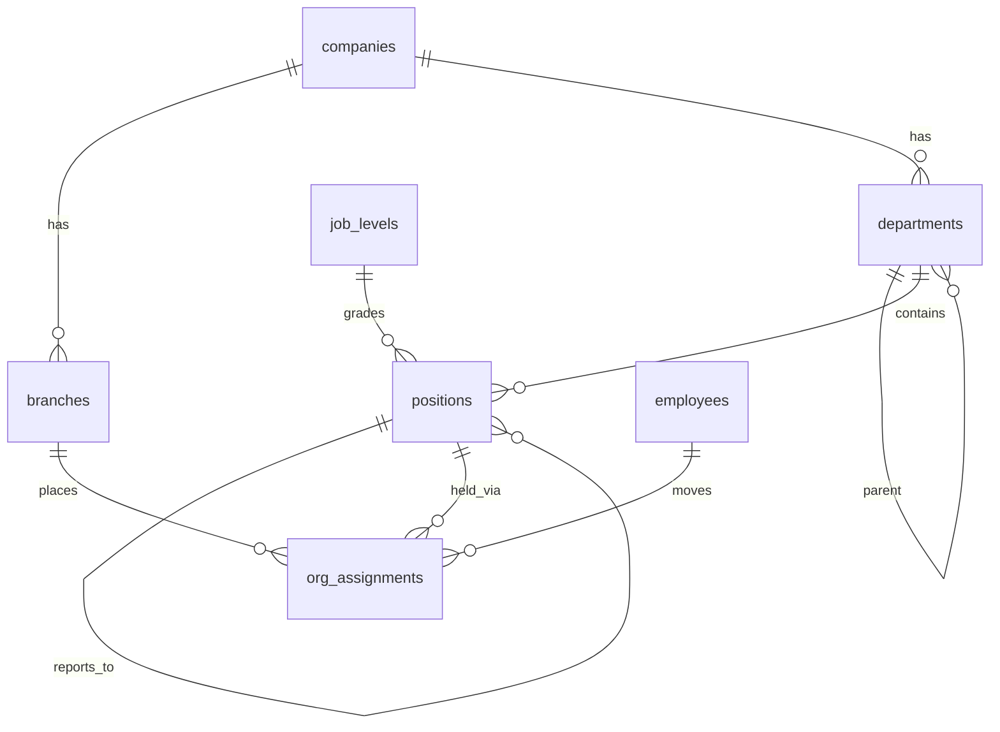
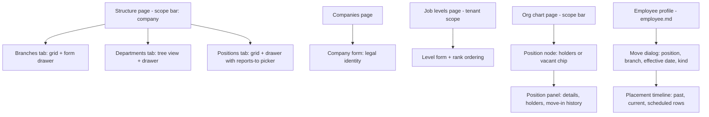

# Module: Organization

Status: Active (Phase 3) · Related ADRs: `ADR-0001` (port-only cross-module reads), `ADR-0002` (tenant scoping), `ADR-0005` (company-scoped role interplay), `ADR-0008` (resolver source) · Depends on: `docs/06-modules/holiday.md` (template), `docs/04-database/core-schema.md` §7, `docs/04-database/database-conventions.md` §5 · Consumers: approval-engine.md (`direct_manager` / `position_holder` resolvers — §13 forward requirement fulfilled here), employee.md (placement, hire assignment), shift.md / attendance.md (branch timezone, placement), leave.md / payroll.md (placement as-of period), settings.md + holiday.md (deferred `branch_id` FKs fulfilled by this module's migration)

Namespace `organization` (naming §4, error prefix `ORG`). Company legal identity, branches (timezone owners), department hierarchy, job levels, positions with reporting lines, and effective-dated employee placement. Inherits all global standards; deviations only.

## 1. Purpose & Scope

Own the structural truth every time- and money-math module reads: which company an employee sits in, at which branch (and therefore which timezone), in which department, holding which position at which level, reporting to whom — all queryable as-of any date. Exposes the reporting-line and position-holder queries the approval engine resolves against at step activation.

**V1 exclusions:** matrix organizations (one employee, one live placement — §5.6), per-employee manager overrides (reporting line is position-based only), cost centers, work locations distinct from branches, org-structure Excel import/export (structure is low-churn admin work; employee bulk placement rides `employee.master` import), mobile org chart (admin-web only; employees see their own manager/team via employee.md profile), non-Indonesian timezones, headcount budgeting / position capacity enforcement.

## 2. Actors & Permissions

| Action | Permission key | Data scope | Employee | Manager | HR Staff | HR Admin | System Administrator |
|---|---|---|---|---|---|---|---|
| View org chart | — (authenticated, admin web) | own company (non-admin) | ✅ | ✅ | ✅ | ✅ | ✅ |
| Read companies | `organization.company.read` | company / tenant per assignment | — | — | ✅ | ✅ | ✅ |
| Create / edit / archive companies | `organization.company.configure` | edit: own companies; create/archive: tenant-wide assignment required | — | — | — | ✅ | ✅ |
| Read structure (branches, departments, job levels, positions) | `organization.structure.read` | company / tenant per assignment | — | — | ✅ | ✅ | ✅ |
| Configure structure | `organization.structure.configure` | company / tenant per assignment; job levels are tenant-wide → tenant-wide assignment required | — | — | — | ✅ | ✅ |
| Read placement history | `organization.assignment.read` | company / tenant per assignment (own history: employee.md profile) | — | — | ✅ | ✅ | ✅ |
| Move employee (create/cancel assignments) | `organization.assignment.assign` | company / tenant per assignment | — | — | — | ✅ | ✅ |

Company-scoped admins operate only inside their companies; tenant-wide objects (companies themselves, job levels) require a tenant-wide assignment (BR-AUTHZ-007 mirror). Out-of-scope rows are 404.

## 3. Business Rules

| # | Rule |
|---|---|
| BR-ORG-001 | Structure containment: tenant → companies → branches (physical, each owning one IANA timezone from `Asia/Jakarta` \| `Asia/Makassar` \| `Asia/Jayapura`) and departments (functional, company-owned hierarchy). Branches and departments are independent axes — nothing ties a department to a branch; placement pairs them per employee. Positions live in a department, carry a tenant-wide job level and an optional `reports_to` position. |
| BR-ORG-002 | Placement = effective-dated `org_assignments` row (employee → position + branch), interval `[effective_from, effective_to)` per database-conventions §5, **no overlap per employee** (gist exclusion). At most one placement is live per employee per date. Position and branch must belong to the employee's company (`ORG_CROSS_COMPANY`) — cross-company transfer is terminate + rehire (employee.md, spec §5.6). **Placement is mandatory from day one** (grilled 2026-08-02): employee creation writes the hire assignment (`effective_from` = join date) in the same transaction via `OrgPlacementPort.assignOnHire` — create form, `employee.master` import, and recruitment conversion all carry position + branch. |
| BR-ORG-003 | Reporting line is a **position walk**: an employee's managers = live holders (as-of the query date) of the position their position `reports_to`; `direct_manager(n)` walks n `reports_to` edges up from the employee's position and returns the holders of exactly that position, always excluding the subject employee. Holders = employees with a live assignment, status `active` or `on_leave`, and a linked user account. |
| BR-ORG-004 | Graphs stay acyclic, checked at write (`ORG_CYCLE_DETECTED`): `departments.parent_department_id` (depth ≤ 6) and `positions.reports_to_position_id` (self-reference included). Re-parenting moves the whole subtree — descendants are never re-linked implicitly. |
| BR-ORG-005 | Vacancy is legal: a position may have zero live holders. Consumers own the consequence (approval vacancy ladder BR-APRV-006; org chart renders vacant seats). Nothing here auto-fills or blocks vacancies. |
| BR-ORG-006 | Archive = soft delete, blocked while live dependents exist (`ORG_IN_USE`, `details: { blockers: [{ type, count }] }`): **company** — active employees, live role assignments (`user_roles.company_id`, authorization-rbac §9 promise), live branches/departments/positions; **branch** — live or future assignments; **department** — live positions or child departments; **position** — live or future holders, or live positions reporting to it; **job level** — live positions using it. Dependents are removed by explicit acts first, never cascaded (BR-AUTHZ-005 philosophy). |
| BR-ORG-007 | Branch timezone changes affect **future interpretation only** — stored punches are UTC and derived attendance is snapshotted (attendance.md). The edit emits `organization.branch.updated` and the UI carries an explicit warning; attendance recomputes derived state for future dates on the event (consumer duty). |
| BR-ORG-008 | A move is a **supersede**: creating an assignment effective `X` closes the current row at `X` and inserts the successor in one transaction (repository `supersede()`, database-conventions §5.4). Assignments effective inside a locked attendance/payroll period are rejected (`ORG_PERIOD_LOCKED`) via **`PeriodLockPort`** — placement drives proration and cost attribution, so locked history is immutable. The port is owned and implemented by `docs/06-modules/attendance.md` §4.2 (grilled 2026-08-02); the "answers open until payroll.md lands" stub is retired. |
| BR-ORG-009 | All six owned tables are audited channel-1 with full diffs (audit-log §4.2, registered this session). Assignment kinds (`hire`/`transfer`/`promotion`/`correction`) are descriptive metadata for history and reports, never enforced state. |
| BR-ORG-010 | Cross-module access is port-only (ADR-0001): consumers call `OrgQueryPort` / `OrgPlacementPort` (§4.2) — no module joins org tables directly. The engine's `role_holders` resolver is authz data, not this module's concern. |

## 4. Domain Model

### 4.1 Schema



`companies` is defined in core-schema §7 (owner: this module). This module's migration extends it with legal identity (all nullable — filled by admins post-provisioning):

```ts
// additions to companies (src/database/schema/organization.ts)
legalName: text('legal_name'),        // PT ... as registered
npwp: text('npwp'),                   // corporate tax id — printed on tax documents, outside ADR-0016 scope
address: text('address'),
phone: text('phone'),
```

```ts
export const orgAssignmentKind = pgEnum('org_assignment_kind', ['hire', 'transfer', 'promotion', 'correction']);

export const branches = pgTable('branches', {
  ...id, ...tenantId,
  companyId: uuid('company_id').notNull().references(() => companies.id),
  code: text('code').notNull(),                       // human key for imports
  name: text('name').notNull(),
  timezone: text('timezone').notNull(),               // IANA; CHECK: 3 Indonesian zones (BR-ORG-001)
  address: text('address'),
  latitude: numeric('latitude', { precision: 9, scale: 6 }),   // geofence center; radius policy lives in attendance settings
  longitude: numeric('longitude', { precision: 9, scale: 6 }),
  ...auditColumns, ...softDeleteColumns,
}, (t) => [
  uniqueIndex('uq_branches_tenant_id_company_id_code')
    .on(t.tenantId, t.companyId, t.code).where(sql`deleted_at IS NULL`),
  index('idx_branches_tenant_id_company_id').on(t.tenantId, t.companyId),
]);

export const departments = pgTable('departments', {
  ...id, ...tenantId,
  companyId: uuid('company_id').notNull().references(() => companies.id),
  parentDepartmentId: uuid('parent_department_id')
    .references((): AnyPgColumn => departments.id),   // NULL = top level
  code: text('code').notNull(),
  name: text('name').notNull(),
  ...auditColumns, ...softDeleteColumns,
}, (t) => [
  uniqueIndex('uq_departments_tenant_id_company_id_code')
    .on(t.tenantId, t.companyId, t.code).where(sql`deleted_at IS NULL`),
  index('idx_departments_tenant_id_parent').on(t.tenantId, t.parentDepartmentId),
]);

export const jobLevels = pgTable('job_levels', {      // tenant-wide grade bands
  ...id, ...tenantId,
  code: text('code').notNull(),
  name: text('name').notNull(),
  rank: integer('rank').notNull(),                    // ordering only; ties allowed (parallel bands)
  ...auditColumns, ...softDeleteColumns,
}, (t) => [
  uniqueIndex('uq_job_levels_tenant_id_code').on(t.tenantId, t.code).where(sql`deleted_at IS NULL`),
]);

export const positions = pgTable('positions', {
  ...id, ...tenantId,
  companyId: uuid('company_id').notNull().references(() => companies.id),
  departmentId: uuid('department_id').notNull().references(() => departments.id),
  jobLevelId: uuid('job_level_id').notNull().references(() => jobLevels.id),
  code: text('code').notNull(),
  title: text('title').notNull(),
  reportsToPositionId: uuid('reports_to_position_id')
    .references((): AnyPgColumn => positions.id),     // NULL = top of a reporting tree
  ...auditColumns, ...softDeleteColumns,
}, (t) => [
  uniqueIndex('uq_positions_tenant_id_company_id_code')
    .on(t.tenantId, t.companyId, t.code).where(sql`deleted_at IS NULL`),
  index('idx_positions_tenant_id_department').on(t.tenantId, t.departmentId),
  index('idx_positions_tenant_id_reports_to').on(t.tenantId, t.reportsToPositionId),
]);

export const orgAssignments = pgTable('org_assignments', {
  ...id, ...tenantId,
  employeeId: uuid('employee_id').notNull().references(() => employees.id),
  positionId: uuid('position_id').notNull().references(() => positions.id),
  branchId: uuid('branch_id').notNull().references(() => branches.id),
  kind: orgAssignmentKind('kind').notNull(),
  note: text('note'),
  ...effectiveDating, ...auditColumns, ...softDeleteColumns,
}, (t) => [
  index('idx_org_assignments_tenant_id_employee_id_effective_from')
    .on(t.tenantId, t.employeeId, t.effectiveFrom),
  index('idx_org_assignments_tenant_id_position_id').on(t.tenantId, t.positionId),   // positionHolders
  index('idx_org_assignments_tenant_id_branch_id').on(t.tenantId, t.branchId),       // branch archive guard
]);
```

Hand-written in the generating migration (database-conventions §10):

- `ck_branches_timezone` — `timezone IN ('Asia/Jakarta','Asia/Makassar','Asia/Jayapura')`; `ck_branches_coordinates` — `(latitude IS NULL) = (longitude IS NULL)`.
- `excl_org_assignments_no_overlap` — gist exclusion on `(tenant_id, employee_id, daterange(effective_from, effective_to, '[)'))` `WHERE deleted_at IS NULL` (BR-ORG-002, database-conventions §5.2 verbatim).
- **Deferred-FK fulfillment:** `fk_setting_values_branches` on `setting_values.branch_id` and `fk_holidays_branches` on `holidays.branch_id` → `branches.id` (the two columns settings §4.1 and holiday §4.1 shipped FK-less because this module generates later).

No `version` column anywhere: all mutations are admin-web, nothing is offline-mutable (database-conventions §1.10 scope; holiday §4.1 precedent). No lifecycle state machines: companies/branches/departments/job levels/positions are present-or-archived reference data, and `org_assignments` rows are positions on the date axis (scheduled / current / history), not statuses — settings §4.1 precedent (template note honored).

### 4.2 Ports (the consumer contracts)

```ts
export const ORG_QUERY_PORT = Symbol('ORG_QUERY_PORT');

export interface OrgQueryPort {
  /**
   * Live placement as-of a date; null when the employee has none (pre-assignment).
   *
   * **The display names are part of the contract, added 2026-08-07 (employee.md's
   * arrival, A-195).** As originally written this returned ids only, which made
   * both of employee.md §7's placement shapes unimplementable: the grid renders
   * `{ positionTitle, branchName, departmentName }`, `/me/profile` renders six
   * names, and no consumer has a sanctioned channel to turn one of these ids into
   * a name — `employee_directory` is about employees, and joining this module's
   * tables is the ADR-0001 rule 2 violation the port exists to prevent. Resolving
   * them here costs three extra joins on a query that already made two, over a
   * page of at most a hundred rows. Additive: every existing consumer reads the
   * same ids it always did.
   */
  placement(employeeId: string, asOf: string): Promise<{
    companyId: string; companyName: string;
    branchId: string; branchName: string; branchTimezone: string;
    departmentId: string; departmentName: string;
    positionId: string; positionTitle: string;
    jobLevelId: string; jobLevelName: string;
  } | null>;
  /** Batch form for grids (employee.md list enrichment — added 2026-08-02). One query, keyed result. */
  placements(employeeIds: string[], asOf: string): Promise<Map<string, Awaited<ReturnType<OrgQueryPort['placement']>>>>;
  /** BR-ORG-003 — approval resolver `direct_manager(levels)`. User ids, subject excluded. */
  directManagers(employeeId: string, levels: number, asOf: string): Promise<string[]>;
  /** BR-ORG-003 holder rule — approval resolver `position_holder`. */
  positionHolders(positionId: string, asOf: string): Promise<string[]>;
  /**
   * Does this position exist and is it live? approval-engine §8 validates a
   * chain's resolver references at config-write time, and this is the one it
   * cannot ask any other way (added 2026-08-07, A-196).
   *
   * A different question from `positionHolders` answering empty: a live but
   * vacant position is what BR-APRV-006's vacancy ladder exists for, while a
   * deleted one is a chain that can never resolve — and the difference between
   * them is a field entry in the chain editor versus a stuck instance nobody
   * finds until a request is late.
   */
  positionExists(positionId: string): Promise<boolean>;
  /**
   * The reporting line walked **downwards** — employee.md §13 has listed a "team
   * inverse" among the methods it consumes since 2026-08-02 and this section
   * never wrote it; UC-EMP-011's team list is its first caller (added 2026-08-07,
   * A-195). Returns the holders of every position reporting directly to a
   * position the subject holds, so a manager occupying two seats sees both teams
   * as one list.
   *
   * **Employee ids, not user ids, and no account filter** — the two ways it
   * differs from `directManagers`, both deliberate. A direct report who cannot
   * log in is still a direct report; BR-ORG-003's account filter exists so the
   * approval engine cannot assign a step to somebody unable to act on it, which
   * is a different question from who reports to whom.
   */
  directReports(employeeId: string, asOf: string): Promise<string[]>;
  /**
   * The company a live branch belongs to, `null` when none does (added 2026-08-11,
   * holiday.md's first caller). §8 of that document asks every scoped row for a
   * branch *"resolvable in caller scope"*, and the branch FK is tenant-wide: a
   * branch of another company inserts cleanly and then addresses a scope chain
   * resolution never walks.
   *
   * One method rather than a boolean `branchExists`, because every caller asking
   * whether a branch exists is really asking whether it belongs to the company it
   * was named beside, and a `true` that does not answer that is a check somebody
   * has to remember to pair.
   */
  branchCompanyId(branchId: string): Promise<string | null>;
  /**
   * Every live company of the tenant, ids only (added 2026-08-11, holiday.md's
   * first caller). `PeriodLockPort` answers about **one** company (attendance.md
   * §4.2) while a tenant-wide holiday row addresses all of them at once, so
   * BR-HOL-008's check enumerates. Unpaginated deliberately: a tenant has a
   * handful of companies, and a page would make the caller's loop wrong rather
   * than slow.
   */
  companyIds(): Promise<string[]>;
  /**
   * Audience resolution over placement (announcement.md BR-ANN-002 — added 2026-08-03).
   * Rules union; a `departmentIds` entry **descends its subtree**, `positionIds` and
   * `jobLevelIds` match exactly. An empty rule set means everyone in scope.
   * `companyId: null` = tenant-wide, and requires the caller to hold tenant data scope.
   * Returns employee ids only — the caller maps to users through `employee_directory`.
   */
  audienceEmployeeIds(rules: {
    companyId: string | null;
    branchIds?: string[]; departmentIds?: string[];
    positionIds?: string[]; jobLevelIds?: string[];
  }, asOf: string): Promise<string[]>;
}

export const ORG_PLACEMENT_PORT = Symbol('ORG_PLACEMENT_PORT');

export interface OrgPlacementPort {
  /** Mandatory at employee creation (BR-ORG-002): seeds the initial placement inside the caller's transaction (employee.md hire, recruitment.md conversion). kind = 'hire'. */
  assignOnHire(employeeId: string, positionId: string, branchId: string, effectiveFrom: string): Promise<Result<void>>;
  /** Terminal status effectuation (employee.md BR-EMP-006 — added 2026-08-02): closes the live assignment at the exit date inside the caller's transaction. No-op when none is live. */
  closeOnExit(employeeId: string, effectiveDate: string): Promise<Result<void>>;
}
```

Placement reads are cached (`hris:organization:{tenantId}:placement:{employeeId}`, TTL 5 min) and busted on `organization.assignment.changed` — attendance derivation hits this per punch.

## 5. Use Cases

**UC-ORG-001 — Resolve placement (port, hot path).** As-of query over `org_assignments` (database-conventions §5.3 shape) joined to position/branch/department. Null when no row covers the date — normal only before the join date (hire row is future); any other null is a data anomaly (BR-ORG-002 makes placement mandatory), surfaced by employee.md's "unplaced" grid flag. Consumers fail their own way on null (attendance cannot derive, shift cannot roster).

**UC-ORG-002 — Resolve reporting line (engine, at step activation).** Walk: placement(employee) → position → follow `reports_to` n edges → live holders of the landing position minus the subject, filtered to `active`/`on_leave` employees with user accounts. Chain shorter than n (walked past the top) → empty set — the engine's vacancy ladder takes over (BR-APRV-006). Multiple holders → all returned (engine unions assignees).

**UC-ORG-003 — Move employee.** `organization.assignment.assign` → target position + branch resolved in caller scope → company match (BR-ORG-002) → `effective_from` ≥ employee join date, > current row's `effective_from`, and outside locked periods (BR-ORG-008) → `supersede()` in one tx → audit + `organization.assignment.changed` + cache bust. Future-dated moves are legal (scheduled transfer); the current row's `effective_to` closes at the future date immediately.

**UC-ORG-004 — Cancel a future move.** Only rows with `effective_from` > today: soft-delete the future row and reopen its predecessor (`effective_to = NULL`) in one tx. Past/current rows are corrected by a new `correction` move, never edited in place.

**UC-ORG-005 — Structure CRUD.** Companies/branches/departments/job levels/positions per §7: scope checks (§2), cycle + depth checks on parent/`reports_to` edits (BR-ORG-004), archive guards (BR-ORG-006). Deleting a position referenced by approval-chain resolver configs is allowed with a UI warning — chains hold jsonb refs, and resolution falls to the vacancy ladder at activation (approval-engine §9 already absorbs it).

**UC-ORG-006 — Org chart read.** Positions of a company as a forest over `reports_to`, each node carrying department, level, title, live holders (id + name), and a vacant flag. Non-admin callers are forced to their own company; `rootPositionId` + `depth` params allow subtree loading.

**UC-ORG-007 — Provisioning seed (forward contract; discharged 2026-08-04).** Tenant provisioning (system-administration.md) must create one company and one branch through this module — a tenant with zero companies/branches cannot hold employees. **Honored as written**: system-administration.md BR-ADM-006 and BR-ADM-007 put both creates inside the single provisioning transaction, through this module's facade rather than its tables, in a `TenantContext{source: 'platform-op'}` on the ordinary RLS path — so a `tenants` row without a company cannot exist even transiently, and the provisioning form takes `company.code`/`company.name` and `branch.code`/`branch.name`/`branch.timezone` as required fields for exactly that reason. Recorded in PROGRESS for system-administration.md.

## 6. UI Flow

Admin web only (V1 exclusion, §1).



- **Scope bar** (design-system §12): company selection drives branches/departments/positions tabs and the chart; tenant-wide surfaces (companies, job levels) render without it.
- Departments render as an indentable tree (depth ≤ 6); re-parent via drawer with a subtree-move confirmation. Positions grid shows department, level, title, holder count; vacant positions get the warning-class chip (design-system §2.3) — vacancy is visible, never an error.
- **Move dialog:** effective-date picker warns on backdating; locked-period dates are disabled with the lock tooltip (BR-ORG-008); scheduled moves render on a placement timeline with a cancel action (UC-ORG-004).
- Branch timezone edit shows the destructive-style confirm copy (BR-ORG-007 warning); coordinates picked via map input, optional.
- Archive actions run the blocker check first and list blockers in the confirm dialog (`ORG_IN_USE` details rendered as counts) — never a bare failure toast. Empty states per design-system §6 (new tenant lands on seeded company + branch, UC-ORG-007).

## 7. API

All endpoints: admin web · Queue-reachable **no** · Idempotency **—** (single-row admin mutations). Errors beyond the implied set (error-catalog §1.2) listed per group.

| Endpoint | Permission | Pagination |
|---|---|---|
| `GET /api/v1/companies` | `organization.company.read` | offset |
| `POST /api/v1/companies` · `PATCH /api/v1/companies/{id}` · `DELETE /api/v1/companies/{id}` | `organization.company.configure` | — |
| `GET /api/v1/branches` | `organization.structure.read` | offset |
| `POST /api/v1/branches` · `PATCH /api/v1/branches/{id}` · `DELETE /api/v1/branches/{id}` | `organization.structure.configure` | — |
| `GET /api/v1/departments` | `organization.structure.read` | offset (`?tree=true` unpaginated per company) |
| `POST /api/v1/departments` · `PATCH /api/v1/departments/{id}` · `DELETE /api/v1/departments/{id}` | `organization.structure.configure` | — |
| `GET /api/v1/job-levels` | `organization.structure.read` | — (tenant list, ≤ dozens — deliberate deviation, authz §7 precedent) |
| `POST /api/v1/job-levels` · `PATCH /api/v1/job-levels/{id}` · `DELETE /api/v1/job-levels/{id}` | `organization.structure.configure` (tenant-wide) | — |
| `GET /api/v1/positions` | `organization.structure.read` | offset |
| `POST /api/v1/positions` · `PATCH /api/v1/positions/{id}` · `DELETE /api/v1/positions/{id}` | `organization.structure.configure` | — |
| `GET /api/v1/organization/chart` | — (authenticated) | — (positions scale ~hundreds; subtree params) |
| `GET /api/v1/employees/{employeeId}/org-assignments` | `organization.assignment.read` | — (per-employee history, small) |
| `POST /api/v1/employees/{employeeId}/org-assignments` | `organization.assignment.assign` | — |
| `DELETE /api/v1/employees/{employeeId}/org-assignments/{id}` | `organization.assignment.assign` | — |

#### Companies
`GET` request: `?q=` + offset params. Response 200: `data: [{ id, code, name, legalName, npwp, address, phone, branchCount, employeeCount, updatedAt }]` + meta (scope-filtered per assignment).
`POST` request: `code` (✅, 2–20, `[A-Z0-9-]`), `name` (✅, 2–120), `legalName?`, `npwp?` (15–16 digits), `address?`, `phone?`. Tenant-wide assignment required. Response 201: row. `PATCH`: same fields minus `code` (identity). `DELETE`: soft delete. Errors: duplicate code → `VAL_DUPLICATE` field entry · archive with dependents → `ORG_IN_USE` (BR-ORG-006).

#### Branches
`GET` request: `?companyId=` (required) `?q=` + offset. Response 200: `data: [{ id, companyId, code, name, timezone, address, latitude, longitude, assignmentCount }]` + meta.
`POST` request: `companyId` (✅), `code` (✅, 2–20), `name` (✅, 2–120), `timezone` (✅, one of 3 — BR-ORG-001), `address?`, `latitude?`/`longitude?` (paired). `PATCH`: all but `companyId`/`code`; timezone change → BR-ORG-007 event. `DELETE`: `ORG_IN_USE` while live/future assignments reference it.

#### Departments
`GET` request: `?companyId=` (required) + offset, or `?tree=true` for the full nested forest. Response 200 (flat): `data: [{ id, companyId, parentDepartmentId, code, name, positionCount, depth }]`; (tree): nested `children` arrays.
`POST` request: `companyId` (✅), `parentDepartmentId?`, `code` (✅), `name` (✅). `PATCH`: `name?`, `parentDepartmentId?` (re-parent → cycle/depth check, subtree confirmation is UI-side). Errors: `ORG_CYCLE_DETECTED` (BR-ORG-004) · `ORG_IN_USE` on delete with live positions/children.

#### Job levels
`GET` response 200: `data: [{ id, code, name, rank, positionCount }]` ordered by `rank, name`.
`POST` request: `code` (✅), `name` (✅), `rank` (✅, int ≥ 0; ties allowed). `PATCH`: `name?`, `rank?`. `DELETE`: `ORG_IN_USE` while positions use it.

#### Positions
`GET` request: `?companyId=` (required) `?departmentId=` `?jobLevelId=` `?vacant=true` `?q=` + offset. Response 200: `data: [{ id, companyId, departmentId, jobLevelId, code, title, reportsToPositionId, holderCount }]` + meta.
`POST` request: `companyId` (✅), `departmentId` (✅, same company), `jobLevelId` (✅), `code` (✅), `title` (✅, 2–120), `reportsToPositionId?` (same company). `PATCH`: `title?`, `departmentId?`, `jobLevelId?`, `reportsToPositionId?` (cycle check). Errors: `ORG_CYCLE_DETECTED` · cross-company refs → 404 (existence hiding) · `ORG_IN_USE` on delete with holders or reporting positions.

#### GET /api/v1/organization/chart
Request: `?companyId=` (admins: any in scope; others: forced own) `?rootPositionId=` `?depth=` (default full). Response 200: `data: [{ positionId, code, title, departmentId, departmentName, jobLevelId, rank, reportsToPositionId, holders: [{ employeeId, fullName }], vacant: boolean }]` — flat list, client builds the forest (`reportsToPositionId` edges).

#### Org assignments
`GET` response 200: `data: [{ id, positionId, positionTitle, branchId, branchName, kind, note, effectiveFrom, effectiveTo, createdBy, createdAt }]` newest first — full placement history including scheduled and soft-deleted-cancelled rows flagged `cancelled: true`.
`POST` request:
| Field | Type | Required | Rule |
|---|---|---|---|
| `positionId` | uuid | ✅ | employee's company (BR-ORG-002) |
| `branchId` | uuid | ✅ | employee's company |
| `effectiveFrom` | date | ✅ | ≥ join date, > current `effective_from`, unlocked period |
| `kind` | enum | ✅ | `transfer \| promotion \| correction` (`hire` is port-only, UC-ORG-007/employee.md) |
| `note` | string | — | ≤ 300 |

Response 201: row (predecessor's `effective_to` now set). Errors: `ORG_CROSS_COMPANY` · `ORG_PERIOD_LOCKED` · `ORG_ASSIGNMENT_OVERLAP` (exclusion violation — backdated range collides) · unknown employee/position/branch → 404.
`DELETE`: future rows only (UC-ORG-004); past/current → `VAL_VALIDATION_FAILED` field entry. Response 200: `{ id }` (predecessor reopened).

## 8. Validation Rules

| Field | Rule | Error code |
|---|---|---|
| `code` (all entities) | 2–20, `[A-Z0-9-]`, unique per scope (live rows) | `VAL_INVALID_FORMAT` / `VAL_DUPLICATE` |
| `name` / `title` | required, 2–120, trimmed | `VAL_REQUIRED` / `VAL_TOO_SHORT` / `VAL_TOO_LONG` |
| `timezone` | one of the 3 Indonesian IANA zones | `VAL_INVALID_ENUM` |
| `latitude` / `longitude` | −90..90 / −180..180, both or neither | `VAL_OUT_OF_RANGE` / `VAL_VALIDATION_FAILED` |
| `npwp` | digits, 15–16 | `VAL_INVALID_FORMAT` |
| `rank` | int ≥ 0 | `VAL_OUT_OF_RANGE` |
| `parentDepartmentId` / `reportsToPositionId` | resolvable in scope; acyclic; department depth ≤ 6 | 404 / `ORG_CYCLE_DETECTED` |
| `effectiveFrom` | ISO date; ≥ employee join date; > current row's from | `VAL_OUT_OF_RANGE` (field entry) |
| `kind` | enum, `hire` rejected over HTTP | `VAL_INVALID_ENUM` |

## 9. Edge Cases & Failure Modes

- **Manager position with two holders:** `direct_manager(1)` returns both; the engine unions assignees and quorum policy decides (approval-engine BR-APRV-008). Deliberate — co-manager setups exist.
- **Requester holds the top position** (or the walk passes the top): empty manager set → engine vacancy ladder (BR-APRV-006). The org module never invents a fallback.
- **Peer holders of one position:** never managers of each other — the walk starts one `reports_to` edge above the requester's position, so co-holders are simply absent from the result. Subject exclusion (BR-ORG-003) additionally covers the odd case where the requester also holds the landing position higher up the chain.
- **Employee without live placement:** legitimate only pre-join (hire row future-dated); otherwise an anomaly — BR-ORG-002 seeds placement at creation, and cancel-future-move reopens the predecessor, so no flow manufactures a gap. Port returns null; consumers guard; employee.md flags "unplaced".
- **Backdated correction across a paid period:** rejected by BR-ORG-008 — the correction lands `effective_from` at the first unlocked date; retro pay effects are payroll.md's retro mechanism, not a placement rewrite.
- **Branch archived while holiday/settings rows reference it:** rows stay as history and become unreachable (resolution walks live placements) — settings §9 pattern; nothing dangles because the assignment guard (BR-ORG-006) already forced employees off the branch.
- **Company archive vs role assignments:** blocked until authz assignments are revoked (authorization-rbac §9 promise honored via the `user_roles.company_id` blocker count).
- **Position moved to another department:** assignment rows are untouched (position identity is stable); chart and reports reflect the new department immediately — a department move is not an employee move.
- **Timezone edit at period edge:** future-only semantics (BR-ORG-007); attendance recompute event covers scheduled days; past derived rows are snapshots and immutable.
- **Deleted position in a chain resolver config:** jsonb refs can't FK; activation resolves zero holders → vacancy ladder → possibly stuck instance — surfaced by the engine's oversight, fixed by editing the chain (approval-engine §9 path).

## 10. Offline Behavior

N/A — admin-web only (§1 exclusion). Mobile consumes placement (branch, timezone, manager) through the employee.md profile payload and its sync class; nothing here queues, and the org chart is not on mobile in V1.

## 11. Module Error Codes

Registered this session:

| Code | HTTP | Trigger |
|---|---|---|
| `ORG_IN_USE` | 409 | Archive blocked by live dependents — BR-ORG-006, `details: { blockers: [{ type, count }] }` |
| `ORG_CYCLE_DETECTED` | 422 | Department parent or position reports-to edit would create a cycle (or exceed depth 6) — BR-ORG-004 |
| `ORG_CROSS_COMPANY` | 422 | Assignment mixing companies (position/branch outside the employee's company) — BR-ORG-002 |
| `ORG_ASSIGNMENT_OVERLAP` | 409 | Assignment range collides with existing placement history (exclusion constraint) — BR-ORG-002 |
| `ORG_PERIOD_LOCKED` | 409 | Assignment effective inside a locked attendance/payroll period — BR-ORG-008 |

## 12. Background Jobs & Events

Jobs: none owned.

Events emitted (outbox): `organization.assignment.changed` `{ employeeId, positionId, branchId, effectiveFrom }` — consumers: placement cache bust (§4.2), shift.md (roster validity re-check, forward), employee.md (profile delta refresh); `organization.branch.updated` `{ branchId, changedFields }` — consumer: attendance.md (future-date recompute when `timezone` changed, BR-ORG-007 forward duty). Events consumed: none. Audit rides channel 1 (table registry), not these events.

## 13. Approval, Notification & Report Touchpoints

- **Approval:** none owned — structure and placement changes are direct admin acts. This module **serves** the engine: `OrgQueryPort.directManagers` / `positionHolders` are the `direct_manager` and `position_holder` resolvers (approval-engine §13 forward requirement, fulfilled), and `positionExists` is that section's §8 reference check.
- **Notification:** none — no templates registered. Employee-facing "you were moved" communication is a deliberate tenant act via announcement.md, not automatic. **2026-08-03: that module now exists** and the position holds unchanged — announcement targets by placement, so "everyone in Finance" is one rule rather than a per-move template this module would have had to own.
- **2026-08-03 (announcement.md arrival):** `OrgQueryPort` gains **`audienceEmployeeIds`** (§4.2) — audience resolution over placement, added by the owner on first real caller, the `EmployeeHirePort` / `LeaveBalancePort` / `DevelopmentItemPort` pattern. It lives here and not in announcement for one decisive reason: **a department targeting rule descends the department subtree**, and that walk is this module's tree and this module's depth cap. Resolving it in the consumer would mean announcement joining `departments`, which ADR-0001 rule 2 forbids and no read-model view could fix, because a flat view cannot express ancestry without a materialized path this module has no other reason to keep. The method returns employee ids only — the user mapping is `employee_directory`'s, not this module's, since `employees.user_id` is not an org column.
- **Import/Export:** none in V1 (§1 exclusion). `employee.master` import (employee.md) references branch/department/position/job-level **codes** — the natural keys defined here.
- **Reports:** headcount by company/branch/department/level, vacancy list, and placement-change history surface via reports.md registry.
- **2026-08-03 (recruitment-candidate.md arrival):** BR-ORG-002's third named `assignOnHire` caller — "recruitment.md conversion" — is now **live**, and it turns out to reach this port **indirectly**: recruitment calls employee.md's new `EmployeeHirePort.hire`, which runs `UC-EMP-001` and calls `assignOnHire` from inside it. One hire path, one placement seed, exactly as BR-ORG-002 intended. `job_requisitions` also takes cross-module FKs to `positions` and `branches` (ADR-0001 §5 inventory) — a requisition targets an existing position and **never creates one**, so this module's §1 exclusion of headcount budgeting and position capacity stands untouched: recruitment counts its own openings and nothing here counts seats.
- **Settings:** none registered — no `organization.*` keys; depth caps and zone lists are fixed rules, not tenant policy.

## 14. Test Scenarios

| Scenario | Covers |
|---|---|
| As-of placement: boundary dates (`effective_from` inclusive, `effective_to` exclusive), gap → null, scheduled row not yet live | BR-ORG-002, UC-ORG-001 |
| Supersede atomicity: move closes predecessor + inserts successor in one tx; crash between = impossible (single tx) | BR-ORG-008 |
| Exclusion constraint: backdated overlapping range → `ORG_ASSIGNMENT_OVERLAP`; adjacent ranges sharing a boundary date → legal | BR-ORG-002 |
| Cycle checks: department self-parent, deep cycle, depth 7 → 422; position reports-to self/cycle → 422 | BR-ORG-004 |
| `direct_manager(1)` and `(2)`: single holder, multi-holder union, vacancy at level 1 with holder at level 2 (empty — no skip), walk past top → empty | BR-ORG-003, UC-ORG-002 |
| Subject exclusion: employee whose position reports to a position they also hold → excluded from own manager set | BR-ORG-003 |
| Holder filter: resigned/terminated holder and holder without user account never returned | BR-ORG-003 |
| Cross-company position/branch on move → `ORG_CROSS_COMPANY`; out-of-scope → 404 | BR-ORG-002, §2 |
| Period-lock port: locked month rejects move + cancel; open passes (fake port both ways) | BR-ORG-008 |
| Archive guards per entity: each blocker type produces `ORG_IN_USE` with exact blocker counts; clean entity archives | BR-ORG-006 |
| Timezone edit emits `organization.branch.updated` with `changedFields: ['timezone']`; name-only edit does not | BR-ORG-007 |
| Cancel future move: predecessor reopens (`effective_to NULL`); cancel current/past → 422 | UC-ORG-004 |
| Chart: vacant flag, subtree via `rootPositionId`, non-admin forced own company | UC-ORG-006 |
| Every mutation → channel-1 audit diff row (six tables) | BR-ORG-009 |
| Placement cache: move busts entry; stale-read window bounded by event handling (holiday UC-HOL-001 pattern) | §4.2 |

## 15. Future Improvements

Matrix/secondary assignments (job sharing, acting roles), per-employee manager override (dotted lines), cost centers as a placement dimension, org-structure import/export definitions, position headcount budgeting with vacancy aging, effective-dated structure entities themselves (department renames as history), org chart snapshots/diffs over time, international timezone support.
